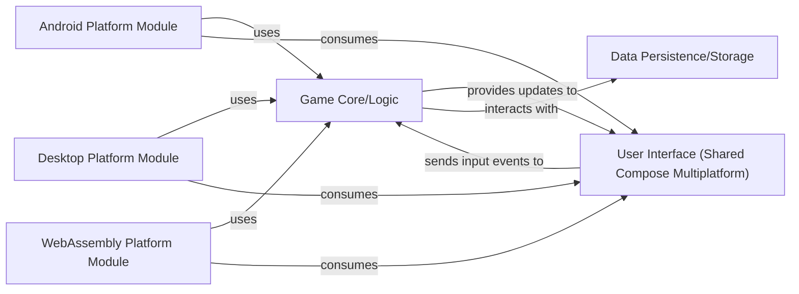

## Details

One paragraph explaining the functionality which is represented by this graph. What the main flow is and what is its purpose.

### Game Core/Logic [[Expand]](./Game_Core_Logic.md)
Encapsulates all platform-agnostic game rules, state management, and core business logic for Solitaire. It defines game behavior, card movements, and win conditions.

**Related Classes/Methods**: _None_

### User Interface (Shared Compose Multiplatform) [[Expand]](./User_Interface_Shared_Compose_Multiplatform_.md)
Provides the shared UI components and rendering logic using Compose Multiplatform, designed to be platform-agnostic. It handles the visual representation of the game board and cards.

**Related Classes/Methods**: _None_

### Android Platform Module [[Expand]](./Android_Platform_Module.md)
Responsible for the Android-specific application entry point, UI rendering on Android devices, handling Android-specific input events, and integrating with native Android APIs.

**Related Classes/Methods**: _None_

### Desktop Platform Module [[Expand]](./Desktop_Platform_Module.md)
Manages the application's lifecycle and UI rendering for Desktop JVM environments, handling desktop-specific input mechanisms.

**Related Classes/Methods**: _None_

### WebAssembly Platform Module [[Expand]](./WebAssembly_Platform_Module.md)
Handles the application's execution and UI rendering within a WebAssembly environment, managing web-specific interactions.

**Related Classes/Methods**: _None_

### Data Persistence/Storage [[Expand]](./Data_Persistence_Storage.md)
Abstracts the underlying data storage mechanisms, providing a unified interface for the Game Core/Logic to save and load game state and user preferences.

**Related Classes/Methods**: _None_

### [FAQ](https://github.com/CodeBoarding/GeneratedOnBoardings/tree/main?tab=readme-ov-file#faq)