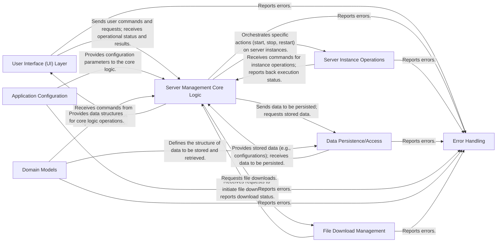

## Details

This section synthesizes the architectural components of the server management application, focusing on their responsibilities, key source files, and inter-component relationships, adhering to the principles of a Layered Architecture and Orchestration patterns.

### User Interface (UI) Layer [[Expand]](./User_Interface_UI_Layer.md)
Provides the primary interaction points for users, encompassing both the command-line interface (CLI) and a web-based graphical user interface (Web GUI) for managing server instances. It handles user input, displays server status, and orchestrates commands.

**Related Classes/Methods**:

- `mcserver.cli`
- `mcserver.webui.index`

### Server Management Core Logic
Encapsulates the high-level business logic for managing server instances, coordinating operations, and maintaining overall server state. It acts as an API layer, exposing well-defined interfaces for consumption by both the CLI and Web GUI.

**Related Classes/Methods**:

- `mcserver.core.core` (1:1)

### Server Instance Operations
Manages specific lifecycle operations for individual server instances, such as starting, stopping, restarting, and monitoring their health and status.

**Related Classes/Methods**:

- `mcserver.instance.operations` (1:1)

### Data Persistence/Access
Handles the storage and retrieval of application data, including server configurations, user preferences, and operational logs, ensuring data integrity and availability.

**Related Classes/Methods**:

- `mcserver.data.persistence` (1:1)

### Application Configuration
Manages application-wide settings and configurations, providing a centralized and consistent mechanism for accessing and modifying parameters that control application behavior.

**Related Classes/Methods**:

- `mcserver.config` (1:1)

### Domain Models
Defines the data structures and behaviors of the core entities within the server management domain, such as `ServerInstance`, `Configuration`, `LogEntry`, etc., ensuring a consistent data representation.

**Related Classes/Methods**:

- `mcserver.models.models` (1:1)

### File Download Management
Manages the process of downloading necessary server files, updates, or other external resources required for server instance operation or application functionality.

**Related Classes/Methods**:

- `mcserver.download.downloader` (1:1)

### Error Handling
Provides a centralized mechanism for handling and reporting errors and exceptions across the application, ensuring robust and user-friendly error messages and logging.

**Related Classes/Methods**:

- <a href="https://github.com/BravestCheetah/StructureBlock/blob/main/src/mcserver/errors.py#L1-L1" target="_blank" rel="noopener noreferrer">`mcserver.errors` (1:1)</a>

### [FAQ](https://github.com/CodeBoarding/GeneratedOnBoardings/tree/main?tab=readme-ov-file#faq)