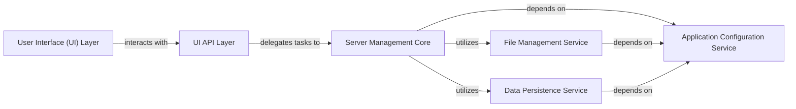

## Details

The `StructureBlock` application employs a layered architecture for server management, featuring distinct User Interface (UI) and API layers that interact with a robust backend. The **User Interface (UI) Layer**, comprising both CLI and Web GUI, serves as the primary interaction point for users, channeling requests through the **UI API Layer**. This API layer acts as a facade, translating UI commands into calls to the **Server Management Core**, which is the central orchestrator for server lifecycle and operations. The Server Management Core, in turn, relies on the **File Management Service** for acquiring necessary external assets and the **Data Persistence Service** for storing and retrieving all application data. All components consistently depend on the **Application Configuration Service** for centralized settings, ensuring a modular, maintainable, and scalable system for managing server instances.

### User Interface (UI) Layer [[Expand]](./User_Interface_UI_Layer.md)
Provides the primary interaction points for users, encompassing both the command-line interface (CLI) and a web-based graphical user interface (Web GUI) for managing server instances.

**Related Classes/Methods**:

- <a href="https://github.com/BravestCheetah/StructureBlock/blob/main/src/mcserver/cli.py" target="_blank" rel="noopener noreferrer">`src/mcserver/cli.py`</a>
- <a href="https://github.com/BravestCheetah/StructureBlock/blob/main/src/mcserver/webui/index.py" target="_blank" rel="noopener noreferrer">`src/mcserver/webui/index.py`</a>

### UI API Layer
Serves as the public API, abstracting core server management functionalities and translating user interface requests into calls to the backend logic, ensuring a consistent interface for both frontends.

**Related Classes/Methods**:

- <a href="https://github.com/BravestCheetah/StructureBlock/blob/main/src/mcserver/gui_interface.py" target="_blank" rel="noopener noreferrer">`src/mcserver/gui_interface.py`</a>

### Server Management Core
The central orchestrator responsible for the lifecycle management of server instances, including creation, deletion, and handling specific operations like start, stop, and status checks. It coordinates operations across other backend services.

**Related Classes/Methods**:

- <a href="https://github.com/BravestCheetah/StructureBlock/blob/main/src/mcserver/backend/server_manager.py" target="_blank" rel="noopener noreferrer">`src/mcserver/backend/server_manager.py`</a>
- <a href="https://github.com/BravestCheetah/StructureBlock/blob/main/src/mcserver/backend/server.py" target="_blank" rel="noopener noreferrer">`src/mcserver/backend/server.py`</a>

### File Management Service
Manages the acquisition and handling of external files, such as server software and configuration templates, necessary for server setup and operation.

**Related Classes/Methods**:

- <a href="https://github.com/BravestCheetah/StructureBlock/blob/main/src/mcserver/backend/downloader.py" target="_blank" rel="noopener noreferrer">`src/mcserver/backend/downloader.py`</a>

### Data Persistence Service
Provides mechanisms for storing and retrieving application data, including server configurations and instance metadata, abstracting the underlying storage implementation.

**Related Classes/Methods**:

- <a href="https://github.com/BravestCheetah/StructureBlock/blob/main/src/mcserver/backend/data.py" target="_blank" rel="noopener noreferrer">`src/mcserver/backend/data.py`</a>

### Application Configuration Service
Centralizes and provides access to all application-wide settings, paths, and configurable parameters, ensuring consistent configuration across the system.

**Related Classes/Methods**:

- <a href="https://github.com/BravestCheetah/StructureBlock/blob/main/src/mcserver/settings.py" target="_blank" rel="noopener noreferrer">`src/mcserver/settings.py`</a>

### [FAQ](https://github.com/CodeBoarding/GeneratedOnBoardings/tree/main?tab=readme-ov-file#faq)