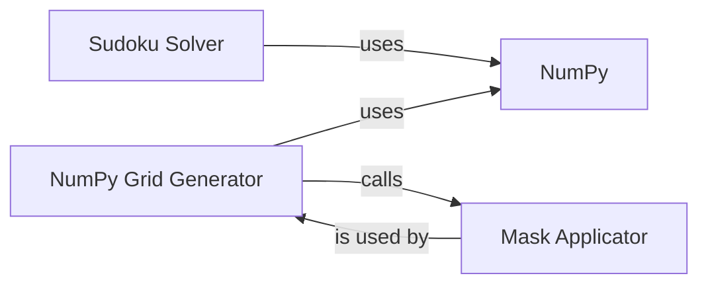

## Component Details

### NumPy Grid Generator
This component is responsible for generating a complete and valid Sudoku grid using NumPy arrays. It initializes an empty grid and iteratively fills it with numbers, ensuring that the Sudoku rules (uniqueness within rows, columns, and 3x3 subgrids) are satisfied. The process restarts if a valid number cannot be placed in a cell, ensuring a valid grid is eventually generated. It leverages NumPy for efficient array manipulation and validation.
- **Related Classes/Methods**: `sudokum.method.np_union.generate`

### Mask Applicator
This component takes a complete Sudoku grid and applies a mask to create a puzzle. The mask determines which cells are hidden (set to 0) to create the puzzle's difficulty. The mask rate controls the proportion of hidden cells. The component shuffles a boolean array representing the mask and applies it to the grid, effectively removing numbers from the complete grid to form the Sudoku puzzle.
- **Related Classes/Methods**: `sudokum.method.mask.mask`

### NumPy
NumPy is a fundamental Python library for numerical computations. In the Sudoku puzzle generation context, it provides efficient array operations for creating, manipulating, and validating the Sudoku grid. It is used extensively in the grid generation process for tasks such as initializing the grid, placing numbers, and checking for rule violations.
- **Related Classes/Methods**: _None_

### Sudoku Solver
This component implements a solver for Sudoku puzzles. It takes a Sudoku grid as input and attempts to find a valid solution by filling in the empty cells while adhering to the Sudoku rules. The solver can be used to verify the uniqueness of solutions for generated puzzles or to provide solutions to users.
- **Related Classes/Methods**: `sudokum.method.np_union.solve`
