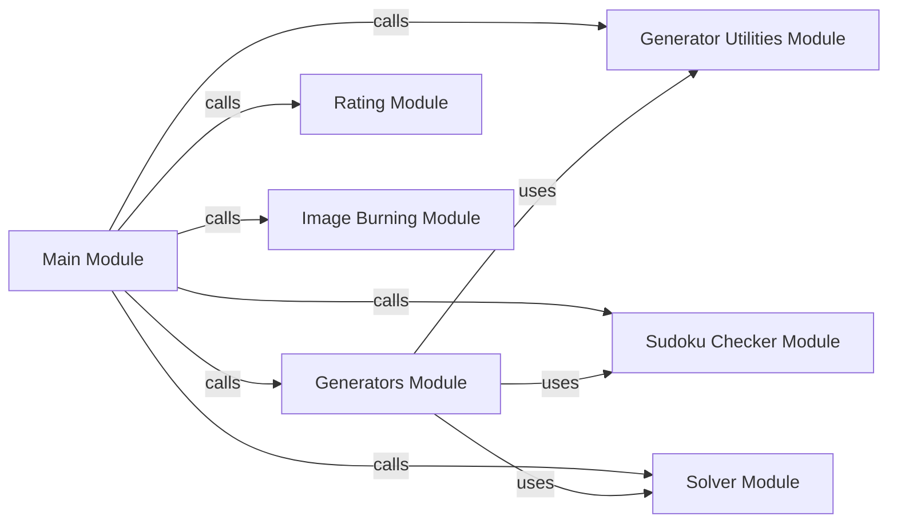

## Component Details

### Main Module
The main module serves as the entry point for the Sudoku application. It handles user input, calls the appropriate functions for generating, solving, and rating Sudoku puzzles, and manages the overall program flow. It orchestrates the interactions between other modules to provide the application's core functionality.
- **Related Classes/Methods**: `src/main/main.py`

### Generators Module
The Generators module is responsible for generating Sudoku puzzles with varying difficulty levels and symmetry. It utilizes utility functions and interacts with the Sudoku Checker and Solver modules to ensure the generated puzzles are valid and have a unique solution.
- **Related Classes/Methods**: `src/generators/Generators.py`

### Rating Module
The Rating module analyzes Sudoku puzzles to determine their difficulty level. It employs various techniques to assess the complexity of solving a puzzle and assigns a corresponding difficulty rating.
- **Related Classes/Methods**: `src/ratingSudos/rating.py`

### Image Burning Module
The Image Burning module creates visual representations of Sudoku puzzles in image and PDF formats. It takes a Sudoku grid as input and generates a corresponding image or PDF document, enabling users to easily view and share the puzzles.
- **Related Classes/Methods**: `src/burnImage/burnSudo2Img.py`

### Sudoku Checker Module
The Sudoku Checker module validates Sudoku grids to ensure they adhere to the game's rules. It verifies whether a grid is correctly solved and identifies any conflicts or inconsistencies within the grid.
- **Related Classes/Methods**: `src/checkers/SudoCheck.py`

### Generator Utilities Module
The Generator Utilities module provides a collection of utility functions that support the generation of Sudoku puzzles. These functions include grid creation, solution counting, and symmetry pattern generation, enhancing the flexibility and control over the puzzle generation process.
- **Related Classes/Methods**: `src/utils/GeneratorUtils.py`

### Solver Module
The Solver module implements algorithms to solve Sudoku puzzles. It employs techniques such as brute force and constraint satisfaction to find solutions for a given puzzle, providing the application with the ability to automatically solve Sudoku grids.
- **Related Classes/Methods**: `src/solver/solver.py`
