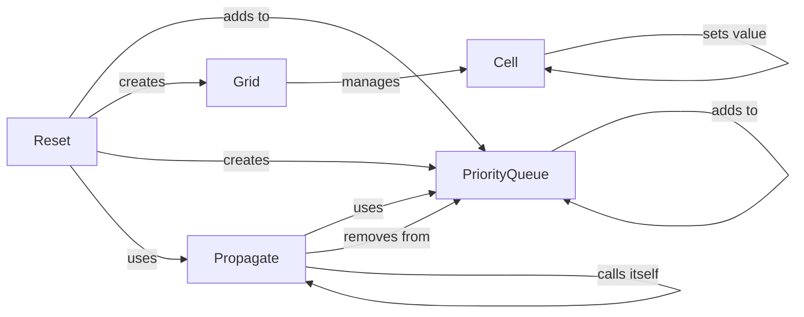

## Component Details

### Grid
The Grid component represents the Sudoku grid as a whole. It holds a collection of Cell objects and provides methods for accessing and manipulating them. It is responsible for initializing the grid, managing cell states, and providing access to rows, columns, and boxes for constraint propagation.
- **Related Classes/Methods**: `sudokum.method.wave_function_collapse.grid.Grid`

### Cell
The Cell component represents a single cell within the Sudoku grid. It stores the possible values (wave) for the cell and whether it has been collapsed to a single value. It provides methods for collapsing the cell, removing possible values, and accessing its neighbors.
- **Related Classes/Methods**: `sudokum.method.wave_function_collapse.cell.Cell`

### PriorityQueue
The PriorityQueue component is used to store cells based on their entropy (number of possible values). Cells with lower entropy are prioritized for collapse. It provides methods for adding cells, removing cells, and retrieving the cell with the lowest entropy.
- **Related Classes/Methods**: `sudokum.method.wave_function_collapse.pq.PriorityQueue`

### Reset
The Reset component is responsible for initializing the grid and priority queue at the start of the Wave Function Collapse algorithm, both for generation and solving. It sets up the initial state of the puzzle, ensuring all cells have the correct possible values and are added to the priority queue.
- **Related Classes/Methods**: `sudokum.method.wave_function_collapse.generate.reset`, `sudokum.method.wave_function_collapse.solve.reset`

### Propagate
The Propagate component enforces Sudoku constraints by updating the possible values of neighboring cells after a cell is collapsed. It removes conflicting values from neighbors and adds them to the priority queue if their entropy changes. This ensures the generated or solved Sudoku adheres to the game's rules.
- **Related Classes/Methods**: `sudokum.method.wave_function_collapse.generate.propagate`
