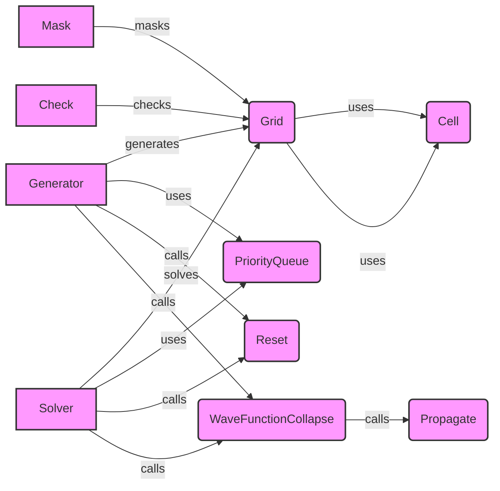

## Component Descriptions

**Generator**
*Description*: Generates a Sudoku grid using the wave function collapse algorithm. It orchestrates the reset, wave function collapse, and masking steps.
*Related Files*: `sudokum.method.wave_function_collapse.generate.generate`

**Grid**
*Description*: Represents the Sudoku grid and its state during the wave function collapse algorithm. It manages the cells and provides methods to access and manipulate them.
*Related Files*: `sudokum.method.wave_function_collapse.grid.Grid`

**Cell**
*Description*: Represents a single cell within the Sudoku grid, tracking its possible values and state (collapsed or not). It provides methods to collapse the cell and reduce its possible values.
*Related Files*: `sudokum.method.wave_function_collapse.cell.Cell`

**PriorityQueue**
*Description*: A priority queue used to manage the order in which cells are collapsed based on their entropy (number of possible values). It prioritizes cells with lower entropy, making the algorithm more efficient.
*Related Files*: `sudokum.method.wave_function_collapse.pq.PriorityQueue`

**Reset**
*Description*: Resets the grid and priority queue to prepare for a new generation or solving attempt. It initializes the grid with all possible values for each cell and populates the priority queue.
*Related Files*: `sudokum.method.wave_function_collapse.generate.reset`, `sudokum.method.wave_function_collapse.solve.reset`

**WaveFunctionCollapse**
*Description*: Performs the core wave function collapse algorithm to fill the Sudoku grid. It iteratively collapses cells with the lowest entropy and propagates the constraints until the grid is filled or a contradiction is found.
*Related Files*: `sudokum.method.wave_function_collapse.generate.wave_function_collapse`

**Propagate**
*Description*: Propagates constraints after a cell is collapsed, updating the possible values of neighboring cells. This ensures that the Sudoku rules are enforced and reduces the search space.
*Related Files*: `sudokum.method.wave_function_collapse.generate.propagate`

**Solver**
*Description*: Solves a Sudoku grid using the wave function collapse algorithm. It's similar to the generator but starts with a partially filled grid.
*Related Files*: `sudokum.method.wave_function_collapse.solve.solve`

**Mask**
*Description*: Masks the generated Sudoku grid to create a puzzle with a certain difficulty level. It removes some of the numbers from the grid, leaving only a few clues for the solver.
*Related Files*: `sudokum.method.mask.mask`

**Check**
*Description*: Checks if the Sudoku grid is valid and complete. It verifies that all rows, columns, and 3x3 blocks contain the numbers 1-9 without repetition.
*Related Files*: `sudokum.checker.check`