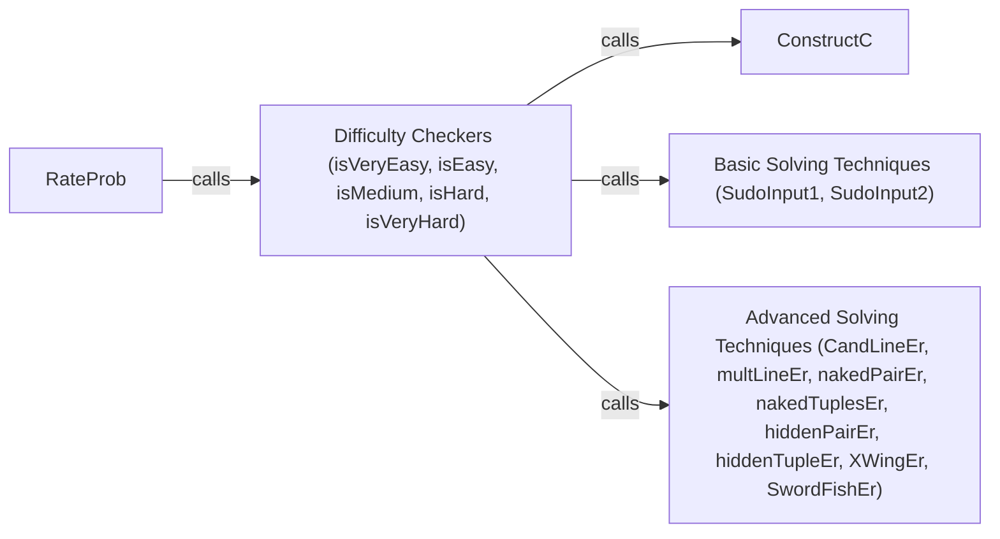

## Component Details

### RateProb
Estimates the difficulty level of a Sudoku puzzle by sequentially checking if it can be solved using increasingly complex techniques. It calls different difficulty level checking functions (isVeryEasy, isEasy, isMedium, isHard, isVeryHard) and returns a numerical rating (1-6) representing the difficulty.
- **Related Classes/Methods**: `src/ratingSudos/rating.py`

### Difficulty Checkers (isVeryEasy, isEasy, isMedium, isHard, isVeryHard)
These functions determine if a Sudoku puzzle can be solved using specific Sudoku solving techniques. Each function represents a different difficulty level and uses a combination of basic and advanced solving techniques. They rely on SolverUtils to apply the solving techniques and return True if the puzzle is solvable with the techniques associated with the difficulty level, and False otherwise.
- **Related Classes/Methods**: `src/utils/RatingUtils.py`

### ConstructC
Constructs a candidate matrix representing possible values for each empty cell in the Sudoku grid. This matrix is used by the difficulty checking functions to apply solving techniques.
- **Related Classes/Methods**: `src/utils/SolverUtils.py`

### Basic Solving Techniques (SudoInput1, SudoInput2)
Implement basic Sudoku solving techniques like 'Single Candidate' (SudoInput1) and 'Single Position' (SudoInput2). These techniques are used by the difficulty checking functions to simplify the puzzle.
- **Related Classes/Methods**: `src/utils/SolverUtils.py`

### Advanced Solving Techniques (CandLineEr, multLineEr, nakedPairEr, nakedTuplesEr, hiddenPairEr, hiddenTupleEr, XWingEr, SwordFishEr)
Implement advanced Sudoku solving techniques like 'Candidate Line Elimination', 'Multiple Line Elimination', 'Naked Pair Elimination', 'Naked Tuples Elimination', 'Hidden Pair Elimination', 'Hidden Tuple Elimination', 'X-Wing Elimination', and 'SwordFish Elimination'. These techniques are used by the difficulty checking functions to solve harder puzzles.
- **Related Classes/Methods**: `src/utils/SolverUtils.py`
