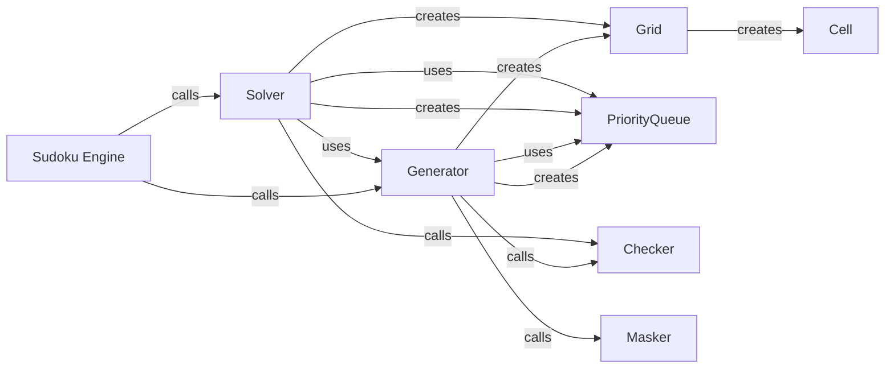

## Component Details

### Sudoku Engine
The Sudoku Engine is the central component responsible for both generating and solving Sudoku puzzles. It orchestrates the use of the Wave Function Collapse algorithm, constraint propagation, and cell collapsing to create valid puzzles and find solutions. It serves as the entry point for external interactions, providing functionalities to generate new puzzles with varying difficulty levels and solve existing puzzles.
- **Related Classes/Methods**: `repos.sudoku.src.sudokum`

### Generator
The Generator module focuses on creating new Sudoku puzzles. It uses the Wave Function Collapse algorithm to generate a complete, valid Sudoku grid. It then employs masking techniques to remove numbers from the grid, creating a puzzle with a specific difficulty level. The module interacts with the Grid, Cell, and PriorityQueue components to manage the Sudoku state and guide the generation process.
- **Related Classes/Methods**: `repos.sudoku.src.sudokum.method.wave_function_collapse.generate`

### Solver
The Solver module is designed to solve existing Sudoku puzzles. It takes a partially filled Sudoku grid as input and attempts to complete it using the Wave Function Collapse algorithm and constraint propagation. It leverages the Grid, Cell, and PriorityQueue components to manage the Sudoku state and prioritize cell collapsing. It also reuses the wave_function_collapse and propagate functions from the Generator module.
- **Related Classes/Methods**: `repos.sudoku.src.sudokum.method.wave_function_collapse.solve`

### Grid
The Grid component represents the Sudoku grid itself. It stores the current state of the puzzle, including the values of each cell and their possible values. It provides methods for accessing and modifying cell values, converting the grid to different representations, and checking the validity of the grid. The Grid component is used by both the Generator and Solver modules to manage the Sudoku state.
- **Related Classes/Methods**: `repos.sudoku.src.sudokum.method.wave_function_collapse.grid.Grid`

### Cell
The Cell component represents a single cell within the Sudoku grid. It stores the possible values for the cell, its coordinates within the grid, and its entropy. It provides methods for collapsing the cell to a single value, reducing the possible values based on constraints, and calculating the cell's entropy. The Cell component is used by the Grid, Generator, and Solver modules to manage the state of individual cells.
- **Related Classes/Methods**: `repos.sudoku.src.sudokum.method.wave_function_collapse.cell.Cell`

### PriorityQueue
The PriorityQueue component is used to manage the order in which cells are collapsed during the Wave Function Collapse algorithm. It prioritizes cells with lower entropy, as these cells are more likely to lead to a valid solution. The PriorityQueue is used by both the Generator and Solver modules to guide the cell collapsing process.
- **Related Classes/Methods**: `repos.sudoku.src.sudokum.method.wave_function_collapse.pq.PriorityQueue`

### Checker
The Checker module provides functionalities to validate the Sudoku grid. It verifies if the current state of the grid adheres to Sudoku rules, ensuring no repetition of numbers in rows, columns, or subgrids. It is used by both the Generator and Solver modules to ensure the generated or solved Sudoku grid is valid.
- **Related Classes/Methods**: `sudokum.checker`

### Masker
The Masker module is responsible for creating Sudoku puzzles from a complete, valid grid. It removes a certain number of cells from the grid, leaving empty cells that the player needs to fill in. The number of removed cells determines the difficulty of the puzzle. It is used by the Generator module to create Sudoku puzzles with varying difficulty levels.
- **Related Classes/Methods**: `sudokum.method.mask`
