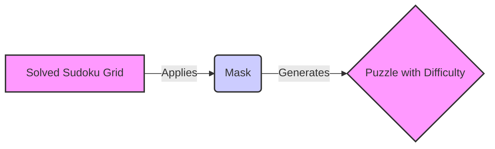

### Component Descriptions:

**1. Solved Sudoku Grid:**
   - *Description*: Represents a fully solved Sudoku grid, typically generated by a Sudoku solver or generator.
   - *Functionality*: Serves as the input to the puzzle generation process. The `Mask` component uses this grid to create a puzzle by removing numbers.
   - *Source Files*: (Likely generated by `Wave Function Collapse Generation` or `NP Union Generation`)

**2. Mask:**
   - *Description*: This component applies a mask to the solved Sudoku grid, strategically removing numbers to create a puzzle.
   - *Functionality*: The mask determines which numbers are removed and thus controls the difficulty of the resulting puzzle. It interacts with the Solved Sudoku Grid by taking it as input and outputting a Sudoku puzzle.
   - *Source Files*: `sudokum.method.mask.mask`

**3. Puzzle with Difficulty:**
   - *Description*: The final Sudoku puzzle, with a specific difficulty level determined by the mask applied.
   - *Functionality*: This is the output of the puzzle generation process, ready to be presented to a user to solve.
   - *Source Files*: (Output of the `Mask` component)
