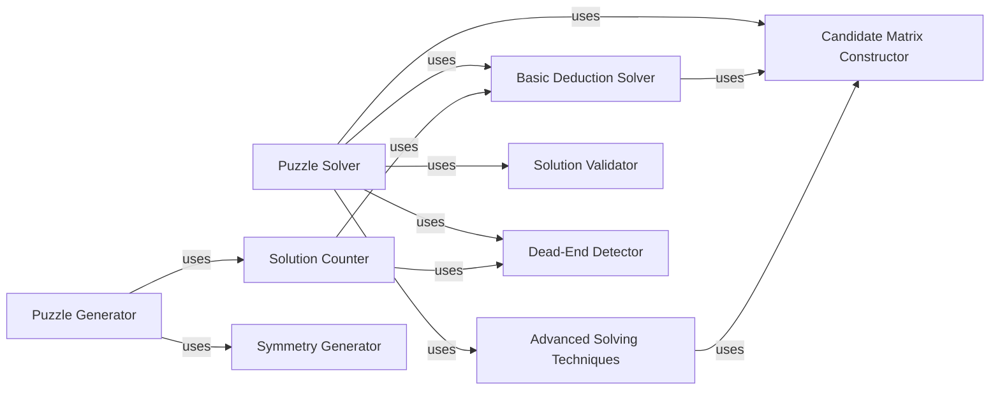

## Component Details

### Puzzle Generator
The Puzzle Generator is responsible for creating new Sudoku puzzles with varying difficulty levels. It uses a combination of random number generation and constraint satisfaction techniques to produce valid and solvable puzzles. The generator ensures that the generated puzzles have a unique solution by counting the number of solutions using the `CountSolutions` component.
- **Related Classes/Methods**: `src/generators/Generators.py`, `src/utils/GeneratorUtils.py`

### Puzzle Solver
The Puzzle Solver component provides functionalities for solving existing Sudoku puzzles using different algorithms. It employs techniques such as constraint propagation, candidate elimination, and backtracking to find the solution to a given puzzle. The solver utilizes the `ConstructC` component to build a candidate matrix and applies various solving techniques like `SudoInput1`, `SudoInput2`, and `SwordFishEr` to deduce the solution.
- **Related Classes/Methods**: `src/solver/solver.py`, `src/utils/SolverUtils.py`

### Candidate Matrix Constructor
The Candidate Matrix Constructor (`ConstructC`) builds a data structure representing the possible candidate values for each empty cell in the Sudoku grid. This matrix is crucial for many solving techniques, as it allows the solver to efficiently track and update the available options for each cell. The candidate matrix stores information about the row, column, and box of each empty cell, as well as the possible numbers that can be placed in that cell.
- **Related Classes/Methods**: `src/utils/SolverUtils.py`

### Basic Deduction Solver
The Basic Deduction Solver applies simple solving techniques to the Sudoku grid, such as single candidate and single position methods. The `SudoInput1` function implements the single candidate method, where if a cell has only one possible value, that value is placed in the cell. The `SudoInput2` function implements the single position method, where if a number can only be placed in one cell within a row, column, or box, that number is placed in that cell.
- **Related Classes/Methods**: `src/utils/SolverUtils.py`

### Advanced Solving Techniques
The Advanced Solving Techniques component implements more sophisticated solving methods, such as X-Wing, Swordfish, Naked Pairs, Hidden Pairs, and other advanced strategies. These techniques are used to identify and eliminate candidates in more complex Sudoku puzzles, where basic deduction is not sufficient to find the solution. The `SwordFishEr`, `XWingEr`, `nakedPairEr`, and `hiddenPairEr` functions implement these advanced techniques.
- **Related Classes/Methods**: `src/utils/SolverUtils.py`

### Solution Validator
The Solution Validator (`IsSudoRight`) checks if the Sudoku is solved correctly by verifying that each row, column, and 3x3 box contains all numbers from 1 to 9 without repetition. This component ensures that the final solution satisfies the Sudoku rules and is a valid solution to the puzzle.
- **Related Classes/Methods**: `src/checkers/SudoCheck.py`

### Dead-End Detector
The Dead-End Detector (`IsDeadEnd`) checks if the current Sudoku grid is a dead end (unsolvable) by detecting contradictions or inconsistencies in the grid. This component helps the solver to avoid exploring unproductive branches in the search space and to backtrack when a dead end is encountered.
- **Related Classes/Methods**: `src/checkers/SudoCheck.py`

### Solution Counter
The Solution Counter (`CountSolutions`) counts the number of solutions for a given Sudoku grid. This is used to ensure that generated puzzles have a unique solution and to assess their difficulty. The counter uses a combination of constraint propagation and backtracking to explore the solution space and determine the number of possible solutions.
- **Related Classes/Methods**: `src/utils/GeneratorUtils.py`

### Symmetry Generator
The Symmetry Generator (`giveSymMat`) generates symmetrical Sudoku grids, where the values are mirrored across the center of the grid. This is often used to create aesthetically pleasing puzzles. The component provides different symmetry patterns, allowing for the generation of a variety of symmetrical Sudoku puzzles.
- **Related Classes/Methods**: `src/utils/GeneratorUtils.py`
