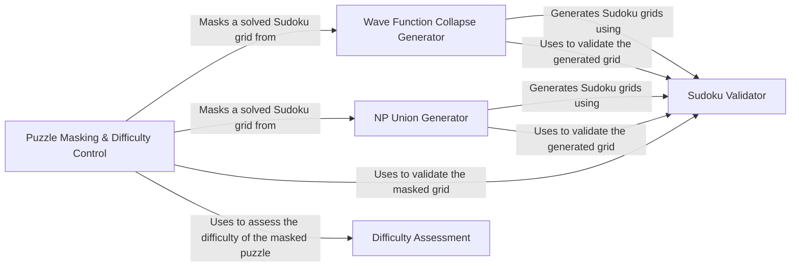

## Component Details

### Wave Function Collapse Generator
Generates a Sudoku grid using the Wave Function Collapse algorithm. It initializes a grid with possible values for each cell and iteratively collapses the possibilities based on constraints until a valid Sudoku grid is generated. This method provides a constraint-based approach to Sudoku generation.
- **Related Classes/Methods**: `sudokum.method.wave_function_collapse.generate`

### NP Union Generator
Generates a Sudoku grid using the NP Union algorithm. This involves creating a set of partially filled grids and combining them to form a complete and valid Sudoku grid. This method offers a different approach to Sudoku generation by combining multiple partial solutions.
- **Related Classes/Methods**: `sudokum.method.np_union.generate`

### Puzzle Masking & Difficulty Control
Transforms a solved Sudoku grid into a playable puzzle by strategically removing numbers. The algorithm determines which cells to hide, aiming to create a puzzle with a unique solution and a desired level of difficulty. This component is crucial for generating engaging and challenging Sudoku puzzles.
- **Related Classes/Methods**: `sudokum.method.mask.mask`

### Sudoku Validator
Validates whether a given Sudoku grid is a valid solution. It checks for rule violations such as duplicate numbers in rows, columns, or 3x3 subgrids. This component ensures the generated and masked Sudoku grids adhere to the fundamental Sudoku rules.
- **Related Classes/Methods**: `sudokum.utils.validate`

### Difficulty Assessment
Analyzes a Sudoku puzzle to determine its difficulty level. This involves evaluating factors such as the number of empty cells, the types of solving techniques required, and the branching factor of the solution space. This component provides feedback for the masking process to achieve the desired difficulty.
- **Related Classes/Methods**: `sudokum.utils.difficulty`
