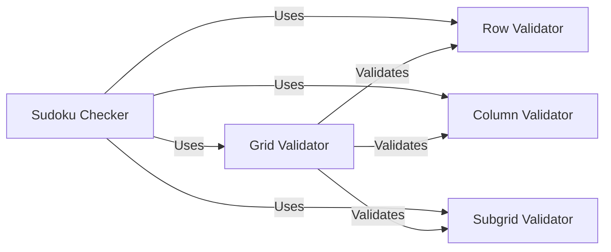

## Component Details

### Sudoku Checker
The Sudoku Checker component is responsible for validating whether a given Sudoku grid adheres to the rules of Sudoku. It checks for duplicate numbers in rows, columns, and 3x3 subgrids. This component is crucial for ensuring the correctness and validity of Sudoku solutions.
- **Related Classes/Methods**: `sudokum.checker.check`

### Grid Validator
The Grid Validator component is responsible for validating the structure and content of the Sudoku grid. It ensures that the grid is of the correct size (9x9) and contains only valid digits (1-9) or empty cells (represented by 0).
- **Related Classes/Methods**: _None_

### Row Validator
The Row Validator component is responsible for validating each row in the Sudoku grid. It checks for duplicate numbers within each row, ensuring that no number appears more than once.
- **Related Classes/Methods**: _None_

### Column Validator
The Column Validator component is responsible for validating each column in the Sudoku grid. It checks for duplicate numbers within each column, ensuring that no number appears more than once.
- **Related Classes/Methods**: _None_

### Subgrid Validator
The Subgrid Validator component is responsible for validating each 3x3 subgrid within the Sudoku grid. It checks for duplicate numbers within each subgrid, ensuring that no number appears more than once.
- **Related Classes/Methods**: _None_
