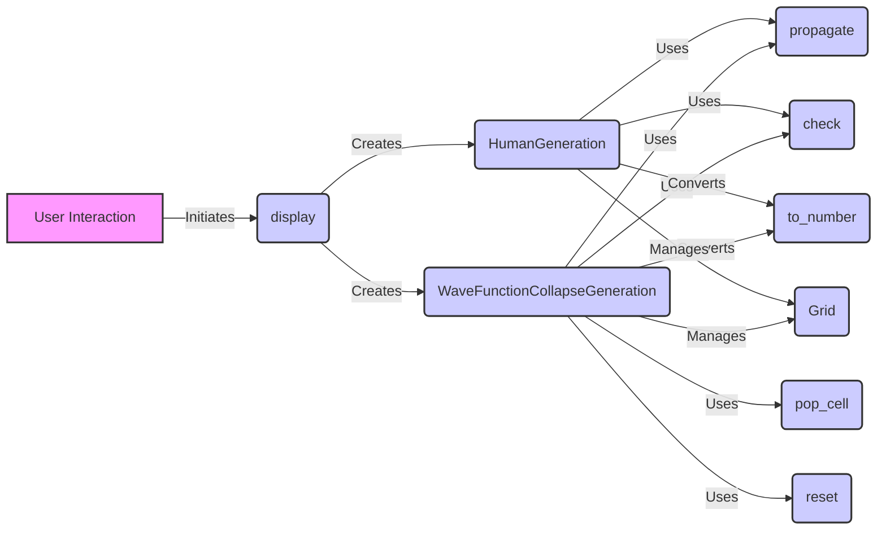

### Component Descriptions:

**User Interaction:**
*Purpose*: Represents the user's interaction with the Sudoku game through the UI.
*Functionality*: Initiates the display of the Sudoku grid and interacts with the HumanGeneration or WaveFunctionCollapseGeneration components.
*Neighbouring Components*: `display`

**display:**
*Purpose*: Displays the Sudoku grid, either in human-guided or automated mode.
*Functionality*: Creates instances of `HumanGeneration` or `WaveFunctionCollapseGeneration` based on the user's choice.
*Neighbouring Components*: `User Interaction`, `HumanGeneration`, `WaveFunctionCollapseGeneration`
*Relevant source files*: `src.sudokum.method.wave_function_collapse.view:display`

**HumanGeneration:**
*Purpose*: Implements the human-guided Sudoku generation process.
*Functionality*: Allows users to manually select cells and values, influencing the generation of the Sudoku grid. Uses `propagate` to maintain constraints, `check` to validate the grid, and `to_number` to convert the grid to a numerical representation. Manages the `Grid`.
*Neighbouring Components*: `display`, `propagate`, `check`, `to_number`, `Grid`
*Relevant source files*: `src.sudokum.method.wave_function_collapse.view.HumanGeneration`

**WaveFunctionCollapseGeneration:**
*Purpose*: Implements the automated Sudoku generation process using the Wave Function Collapse algorithm.
*Functionality*: Automatically selects cells, propagates constraints, and renders the grid. Uses `propagate` to maintain constraints, `pop_cell` to select cells, `reset` to reset the generator, `check` to validate the grid, and `to_number` to convert the grid to a numerical representation. Manages the `Grid`.
*Neighbouring Components*: `display`, `propagate`, `pop_cell`, `reset`, `check`, `to_number`, `Grid`
*Relevant source files*: `src.sudokum.method.wave_function_collapse.view.WaveFunctionCollapseGeneration`

**propagate:**
*Purpose*: Propagates constraints after a cell is collapsed.
*Functionality*: Ensures that the Sudoku rules are maintained throughout the generation process.
*Neighbouring Components*: `HumanGeneration`, `WaveFunctionCollapseGeneration`
*Relevant source files*: `sudokum.method.wave_function_collapse.generate.propagate`

**pop_cell:**
*Purpose*: Selects a cell with the lowest entropy for collapse.
*Functionality*: Guides the generation process towards a valid Sudoku grid.
*Neighbouring Components*: `WaveFunctionCollapseGeneration`
*Relevant source files*: `sudokum.method.wave_function_collapse.generate.pop_cell`

**reset:**
*Purpose*: Resets the state of the generator.
*Functionality*: Allows for a new Sudoku grid to be generated.
*Neighbouring Components*: `WaveFunctionCollapseGeneration`
*Relevant source files*: `sudokum.method.wave_function_collapse.generate.reset`

**check:**
*Purpose*: Checks if the Sudoku grid is valid.
*Functionality*: Ensures that no rules are violated.
*Neighbouring Components*: `HumanGeneration`, `WaveFunctionCollapseGeneration`
*Relevant source files*: `sudokum.checker.check`

**to_number:**
*Purpose*: Converts the Sudoku grid to a number representation.
*Functionality*: Used for storing the grid or performing calculations.
*Neighbouring Components*: `HumanGeneration`, `WaveFunctionCollapseGeneration`
*Relevant source files*: `sudokum.method.wave_function_collapse.grid.Grid.to_number`

**Grid:**
*Purpose*: Represents the Sudoku grid.
*Functionality*: Stores the state of the grid and allows for operations such as setting and getting cell values.
*Neighbouring Components*: `HumanGeneration`, `WaveFunctionCollapseGeneration`
*Relevant source files*: `sudokum.method.wave_function_collapse.grid.Grid`