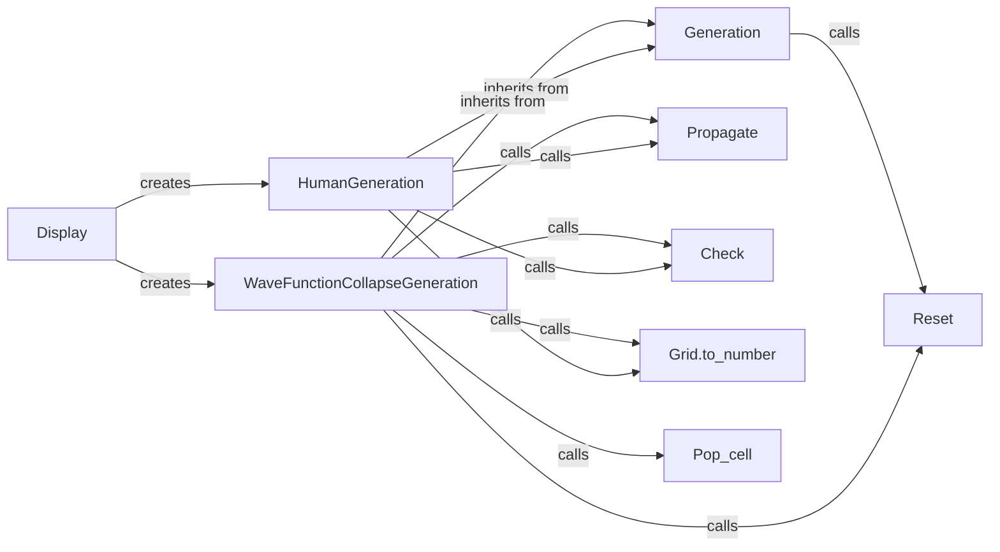

## Component Details

### Generation
The Generation component serves as the abstract base for different Sudoku grid generation methods. It provides common initialization and rendering logic, setting the stage for specific generation algorithms. It likely includes methods for initializing the grid and handling user interactions, forming the foundation for both human-guided and automated generation processes.
- **Related Classes/Methods**: `sudokum.method.wave_function_collapse.view.Generation`

### HumanGeneration
The HumanGeneration component extends the Generation class to implement a Sudoku generation view that allows human interaction. Users can click on cells to propagate constraints, influencing the grid's evolution. This component adds specific logic for handling user clicks and propagating constraints based on those clicks, enabling a collaborative puzzle creation experience.
- **Related Classes/Methods**: `sudokum.method.wave_function_collapse.view.HumanGeneration`

### WaveFunctionCollapseGeneration
The WaveFunctionCollapseGeneration component extends the Generation class to automatically generate Sudoku grids using the Wave Function Collapse algorithm. It implements the WFC algorithm to generate the grid, automating the puzzle creation process. This component focuses on algorithmic generation, contrasting with the human-guided approach of HumanGeneration.
- **Related Classes/Methods**: `sudokum.method.wave_function_collapse.view.WaveFunctionCollapseGeneration`

### Display
The Display component acts as a central point for selecting and rendering the appropriate generation view based on user preferences. It determines whether to display HumanGeneration or WaveFunctionCollapseGeneration, providing a unified interface for accessing different generation methods. This component simplifies the user experience by abstracting the choice of generation algorithm.
- **Related Classes/Methods**: `sudokum.method.wave_function_collapse.view.display`

### Propagate
The Propagate component is responsible for propagating constraints after a cell is clicked or modified. This function is crucial for maintaining the Sudoku rules and ensuring that the grid remains solvable during the generation process. It enforces the game's logic by updating the possible values of neighboring cells based on the current state.
- **Related Classes/Methods**: `sudokum.method.wave_function_collapse.generate.propagate`

### Check
The Check component validates the Sudoku grid, ensuring that the generated or partially filled grid adheres to the Sudoku rules. It prevents invalid states by verifying that no row, column, or 3x3 block contains duplicate numbers. This component is essential for maintaining the integrity of the puzzle.
- **Related Classes/Methods**: `sudokum.checker.check`

### Grid.to_number
The Grid.to_number component converts the Sudoku grid to a numerical representation. This function might be used for efficient storage, comparison, or hashing of the Sudoku grid state. It provides a compact and easily manipulable representation of the grid's contents.
- **Related Classes/Methods**: `sudokum.method.wave_function_collapse.grid.Grid.to_number`

### Pop_cell
The Pop_cell component is responsible for popping a cell from the grid during the Wave Function Collapse algorithm. This function is part of the WFC algorithm's process of selecting and collapsing cells to generate the Sudoku grid. It plays a key role in the automated generation process.
- **Related Classes/Methods**: `sudokum.method.wave_function_collapse.generate.pop_cell`

### Reset
The Reset component clears the Sudoku grid, preparing it for a new generation process. This function is used to start a new generation, either by human interaction or the WFC algorithm. It ensures a clean slate for each new puzzle.
- **Related Classes/Methods**: `sudokum.method.wave_function_collapse.generate.reset`
