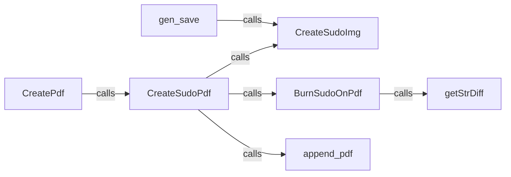

## Component Details

### CreateSudoPdf
This component is responsible for generating a PDF file containing the Sudoku puzzle. It orchestrates the creation of the Sudoku image using `CreateSudoImg` and then appends this image to the PDF document. It also utilizes helper functions to calculate and display differences between the original and solved Sudoku states.
- **Related Classes/Methods**: `src/burnImage/burnSudo2Img.py:CreateSudoPdf`

### CreateSudoImg
This component focuses on creating the visual representation of the Sudoku puzzle as an image. It takes the Sudoku grid data as input and generates an image file that can be displayed or included in other documents. The image visually represents the Sudoku puzzle.
- **Related Classes/Methods**: `src/burnImage/burnSudo2Img.py:CreateSudoImg`

### BurnSudoOnPdf
This component takes a Sudoku image and adds it to an existing PDF. It acts as a bridge between the image generation and PDF creation processes, allowing the Sudoku puzzle to be visually embedded within a PDF document. It leverages `getStrDiff` to highlight differences.
- **Related Classes/Methods**: `src/burnImage/burnSudo2Img.py:BurnSudoOnPdf`

### append_pdf
This component provides the functionality to merge two PDF files together. It's used to combine the generated Sudoku image (as a PDF) with other PDF content, allowing for the creation of more complex documents containing Sudoku puzzles.
- **Related Classes/Methods**: `src/burnImage/burnSudo2Img.py:append_pdf`

### getStrDiff
This component is responsible for generating a string representation of the differences between two Sudoku grids (original and solved). This string is then used to visually highlight the changes in the generated image or PDF.
- **Related Classes/Methods**: `src/burnImage/burnSudo2Img.py:getStrDiff`

### gen_save
This component seems to be the main entry point for generating and saving a Sudoku puzzle. It likely orchestrates the entire process, including generating the Sudoku grid, creating the visual representation, and saving it to a file. It calls `CreateSudoImg` to generate the image.
- **Related Classes/Methods**: `src/main/main.py:gen_save`

### CreatePdf
This component is responsible for creating a PDF document. It serves as a container for the Sudoku puzzle and any additional content. It calls `CreateSudoPdf` to add the Sudoku puzzle to the PDF.
- **Related Classes/Methods**: `src/main/main.py:CreatePdf`
