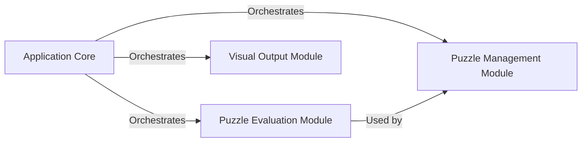

## Component Details

### Application Core
The Application Core serves as the central orchestrator for the Sudoku application. It manages the application's lifecycle, from user input and puzzle generation to solving, rating, and image creation. It acts as the main entry point, coordinating interactions between the other components to deliver the application's functionality.
- **Related Classes/Methods**: `src/main/main.py`

### Puzzle Management Module
The Puzzle Management Module encompasses the generation, solving, and validation of Sudoku puzzles. It provides functionalities for creating new puzzles with varying difficulty levels, solving existing puzzles using different algorithms, and ensuring the validity and solvability of puzzles through constraint checking and dead-end detection. This module is crucial for providing the core Sudoku puzzle logic.
- **Related Classes/Methods**: `src/generators/Generators.py`, `src/utils/GeneratorUtils.py`, `src/solver/solver.py`, `src/utils/SolverUtils.py`, `src/checkers/SudoCheck.py`

### Puzzle Evaluation Module
The Puzzle Evaluation Module focuses on assessing the difficulty of Sudoku puzzles. It employs solving techniques and difficulty assessment functions to categorize puzzles into different difficulty levels. This module relies on the Puzzle Management Module to analyze the puzzle and determine its difficulty based on the solving strategies required.
- **Related Classes/Methods**: `src/ratingSudos/rating.py`, `src/utils/RatingUtils.py`

### Visual Output Module
The Visual Output Module is responsible for generating visual representations of Sudoku puzzles. It creates images and PDFs, highlighting the differences between the original and solved states. This module takes a Sudoku grid as input and produces a visual output for display or printing, enhancing the user experience.
- **Related Classes/Methods**: `src/burnImage/burnSudo2Img.py`