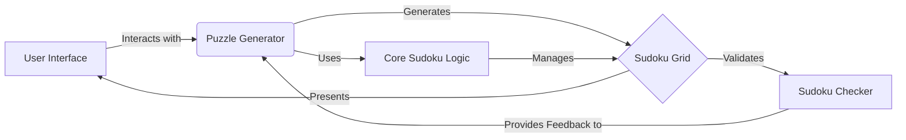

# Sudoku Project Overview

The Sudoku project is a Python application that generates and solves Sudoku puzzles using various algorithms, including Wave Function Collapse and NumPy-based methods. It provides a user interface for interacting with the puzzles and validating their solutions.

## Data Flow Diagram

## Component Descriptions

**A. User Interface:**
The User Interface component provides a way for users to interact with the Sudoku game. It displays the Sudoku grid, allows users to input numbers, and triggers puzzle generation and solving. It relates to the Puzzle Generator by sending user requests and receiving the generated or solved Sudoku grid for display.

**B. Puzzle Generator:**
The Puzzle Generator component is responsible for creating new Sudoku puzzles. It uses the Core Sudoku Logic to generate a complete grid and then applies a masking technique to create a puzzle with a specific difficulty level. It interacts with the User Interface by receiving requests for new puzzles and sending the generated puzzles for display. It also uses the Sudoku Checker to validate the generated puzzles.

**C. Sudoku Grid:**
The Sudoku Grid component represents the Sudoku puzzle as a data structure. It stores the state of each cell in the grid and provides methods for accessing and modifying the grid. It is managed by the Core Sudoku Logic and presented to the User Interface for display.

**D. Sudoku Checker:**
The Sudoku Checker component validates the Sudoku grid to ensure it follows the Sudoku rules. It checks that each row, column, and 3x3 subgrid contains unique numbers. It provides feedback to the Puzzle Generator to ensure that only valid puzzles are generated.

**E. Core Sudoku Logic:**
The Core Sudoku Logic component encapsulates the core algorithms for generating and solving Sudoku puzzles. It uses the Wave Function Collapse algorithm to generate valid Sudoku grids. It manages the Sudoku Grid and is used by the Puzzle Generator to create new puzzles.