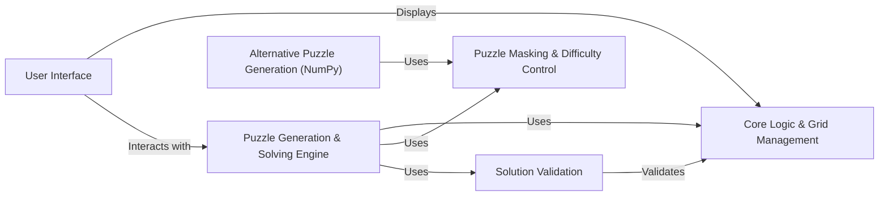

## Component Details

### Core Logic & Grid Management
This component forms the foundation of the Sudoku game. It encompasses the data structures and algorithms necessary for representing the Sudoku grid, managing cell states (possible values), and propagating constraints based on Sudoku rules. It provides the essential building blocks for both puzzle generation and solving processes.
- **Related Classes/Methods**: `sudokum.method.wave_function_collapse.grid.Grid`, `sudokum.method.wave_function_collapse.cell.Cell`, `sudokum.method.wave_function_collapse.pq.PriorityQueue`

### Puzzle Generation & Solving Engine
This component implements the core logic for both generating new Sudoku puzzles and solving existing ones. It leverages the Wave Function Collapse algorithm to create valid Sudoku grids and to deduce the correct values for empty cells in a puzzle. It includes functionalities for resetting the grid, propagating constraints, and collapsing cells based on the WFC algorithm.
- **Related Classes/Methods**: `sudokum.method.wave_function_collapse.generate.generate`, `sudokum.method.wave_function_collapse.generate.reset`, `sudokum.method.wave_function_collapse.generate.propagate`, `sudokum.method.wave_function_collapse.generate.wave_function_collapse`, `sudokum.method.wave_function_collapse.solve.solve`

### Puzzle Masking & Difficulty Control
This component focuses on transforming a solved Sudoku grid into a playable puzzle by strategically removing numbers. The algorithm determines which cells to hide, aiming to create a puzzle with a unique solution and a desired level of difficulty. This component is crucial for generating engaging and challenging Sudoku puzzles.
- **Related Classes/Methods**: `sudokum.method.mask.mask`

### Solution Validation
This component ensures the integrity of the Sudoku puzzles and solutions. It validates Sudoku grids to confirm that they adhere to the fundamental Sudoku rules, verifying the uniqueness and correctness of solutions. This component is essential for guaranteeing the quality and playability of the generated puzzles.
- **Related Classes/Methods**: `sudokum.checker.check`

### User Interface
This component provides the interface through which users interact with the Sudoku game. It handles the display of the Sudoku grid, captures user input, and renders the puzzle's state. It allows users to visualize the puzzle, make moves, and experience the puzzle generation and solving processes.
- **Related Classes/Methods**: `sudokum.method.wave_function_collapse.view.Generation`, `sudokum.method.wave_function_collapse.view.HumanGeneration`, `sudokum.method.wave_function_collapse.view.WaveFunctionCollapseGeneration`, `sudokum.method.wave_function_collapse.view.display`

### Alternative Puzzle Generation (NumPy)
This component offers an alternative approach to generating Sudoku puzzles, potentially leveraging NumPy for efficient array operations. It provides a different method for puzzle creation compared to the Wave Function Collapse algorithm, offering flexibility and potentially different puzzle characteristics.
- **Related Classes/Methods**: `sudokum.method.np_union.generate`, `sudokum.method.np_union.solve`