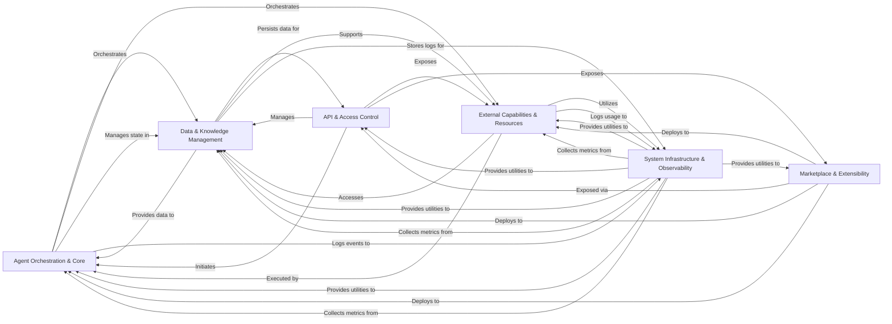

## Component Details

Based on the Control Flow Graph (CFG) and Source Analysis, the SuperAGI architecture can be distilled into six fundamental components, each playing a critical role in the system's operation and extensibility. These components are chosen for their distinct responsibilities, high cohesion, and clear interaction patterns, forming the backbone of the SuperAGI platform.

### Agent Orchestration & Core
This is the central intelligence and execution engine of SuperAGI. It orchestrates the agent's decision-making process, manages task queues, executes predefined workflows, and handles the asynchronous processing of agent steps. It defines how agents perceive, think, and act to achieve their goals, managing their lifecycle from initiation to completion.

**Related Classes/Methods**:

- `superagi.agent` (1:1)
- `superagi.jobs` (1:1)
- `superagi.models.workflows` (1:1)
- <a href="https://github.com/TransformerOptimus/SuperAGI/blob/master/superagi/worker.py#L1-L1" target="_blank" rel="noopener noreferrer">`superagi.worker` (1:1)</a>

### API & Access Control
The primary interface for external systems and users to interact with SuperAGI. It exposes RESTful endpoints for managing agents, toolkits, and other entities, handles request validation, and ensures secure access through robust authentication and authorization mechanisms.

**Related Classes/Methods**:

- `superagi.controllers` (1:1)
- <a href="https://github.com/TransformerOptimus/SuperAGI/blob/master/superagi/helper/auth.py#L1-L1" target="_blank" rel="noopener noreferrer">`superagi.helper.auth` (1:1)</a>

### Data & Knowledge Management
Manages all persistent data, including agent states, execution logs, user information, and system configurations. It defines the database schema, handles ORM operations, and provides a unified interface for interacting with various Large Language Models (LLMs), image generation models, and vector databases for knowledge storage and retrieval.

**Related Classes/Methods**:

- `superagi.models` (1:1)
- <a href="https://github.com/TransformerOptimus/SuperAGI/blob/master/superagi/models/db.py#L1-L1" target="_blank" rel="noopener noreferrer">`superagi.models.db` (1:1)</a>
- `superagi.llms` (1:1)
- `superagi.image_llms` (1:1)
- `superagi.vector_store` (1:1)
- `superagi.vector_embeddings` (1:1)

### External Capabilities & Resources
Equips agents with the ability to interact with the external world. This component includes a diverse set of tools for file operations, web searching, code execution, and integrations with third-party services. It also manages the lifecycle of resources (e.g., files, S3 buckets) and dynamically loads and updates available tools.

**Related Classes/Methods**:

- `superagi.tools` (1:1)
- <a href="https://github.com/TransformerOptimus/SuperAGI/blob/master/superagi/tool_manager.py#L1-L1" target="_blank" rel="noopener noreferrer">`superagi.tool_manager` (1:1)</a>
- `superagi.resource_manager` (1:1)

### System Infrastructure & Observability
Provides foundational services and cross-cutting concerns for the entire SuperAGI application. This includes centralized configuration management, general-purpose utility functions (e.g., token counting, error handling, S3 interactions), and application performance monitoring (APM) for collecting and analyzing system metrics, call logs, and events.

**Related Classes/Methods**:

- <a href="https://github.com/TransformerOptimus/SuperAGI/blob/master/superagi/config/config.py#L1-L1" target="_blank" rel="noopener noreferrer">`superagi.config.config` (1:1)</a>
- `superagi.helper` (1:1)
- `superagi.apm` (1:1)

### Marketplace & Extensibility
A dedicated platform for discovering, installing, and publishing pre-built agent templates, toolkits, and knowledge bases. It fosters a community-driven ecosystem, allowing users to extend SuperAGI's capabilities and promote reusability of components, significantly enhancing the platform's versatility.

**Related Classes/Methods**:

- <a href="https://github.com/TransformerOptimus/SuperAGI/blob/master/superagi/controllers/agent_template.py#L1-L1" target="_blank" rel="noopener noreferrer">`superagi.controllers.agent_template` (1:1)</a>
- <a href="https://github.com/TransformerOptimus/SuperAGI/blob/master/superagi/controllers/toolkit.py#L1-L1" target="_blank" rel="noopener noreferrer">`superagi.controllers.toolkit` (1:1)</a>
- <a href="https://github.com/TransformerOptimus/SuperAGI/blob/master/superagi/controllers/knowledges.py#L1-L1" target="_blank" rel="noopener noreferrer">`superagi.controllers.knowledges` (1:1)</a>
- <a href="https://github.com/TransformerOptimus/SuperAGI/blob/master/superagi/models/marketplace_stats.py#L1-L1" target="_blank" rel="noopener noreferrer">`superagi.models.marketplace_stats` (1:1)</a>

### [FAQ](https://github.com/CodeBoarding/GeneratedOnBoardings/tree/main?tab=readme-ov-file#faq)