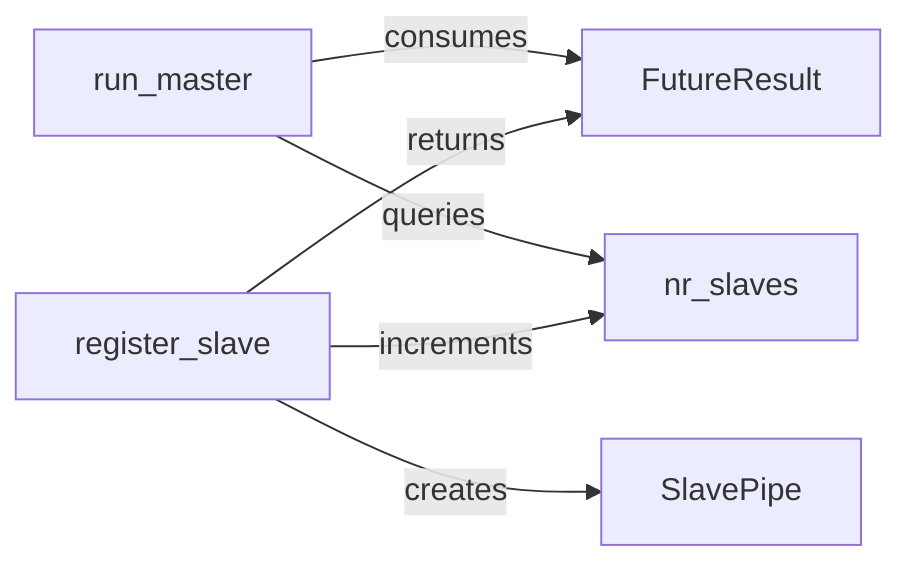

## Details

The `Inter-Device Communication Manager` subsystem is a critical part of the `Synchronized-BatchNorm-PyTorch` project, specifically designed to facilitate the aggregation and distribution of batch statistics (mean, variance, counts) across multiple GPUs. Its boundaries are primarily defined by the `sync_batchnorm/comm.py` file, which encapsulates the core logic for master-slave communication in a distributed computing environment.

### run_master
This component serves as the central control point residing on the master GPU. Its primary responsibility is to initiate the aggregation process, wait for batch statistics (mean, variance, counts) from all registered slave devices, and then potentially distribute aggregated results back. It is fundamental for coordinating the synchronized batch normalization across all participating GPUs.

**Related Classes/Methods**:

- <a href="https://github.com/vacancy/Synchronized-BatchNorm-PyTorch/blob/master/sync_batchnorm/comm.py#L102-L133" target="_blank" rel="noopener noreferrer">`run_master`:102-133</a>

### register_slave
Responsible for establishing and configuring the communication channel for each slave GPU. It sets up a `SlavePipe` instance for bidirectional data exchange and returns a `FutureResult` object, which the master uses to asynchronously collect the slave's statistics. This component is crucial for dynamically adding and managing slave devices within the communication network.

**Related Classes/Methods**:

- <a href="https://github.com/vacancy/Synchronized-BatchNorm-PyTorch/blob/master/sync_batchnorm/comm.py#L84-L100" target="_blank" rel="noopener noreferrer">`register_slave`:84-100</a>

### FutureResult
This component provides a non-blocking, asynchronous mechanism to hold and retrieve batch statistics (mean, variance, counts) sent from slave devices to the master. It embodies a common asynchronous programming pattern, allowing the master to continue its operations while waiting for contributions from slave GPUs.

**Related Classes/Methods**:

- <a href="https://github.com/vacancy/Synchronized-BatchNorm-PyTorch/blob/master/sync_batchnorm/comm.py#L18-L39" target="_blank" rel="noopener noreferrer">`FutureResult`:18-39</a>

### SlavePipe
Represents the concrete communication conduit for data exchange between a slave GPU and the master. It facilitates the sending of local batch statistics (mean, variance, counts) from the slave to the master and can also receive aggregated data or commands from the master, enabling the distributed nature of the batch normalization process.

**Related Classes/Methods**:

- <a href="https://github.com/vacancy/Synchronized-BatchNorm-PyTorch/blob/master/sync_batchnorm/comm.py#L46-L53" target="_blank" rel="noopener noreferrer">`SlavePipe`:46-53</a>

### nr_slaves
This component is a simple counter that tracks the number of active slave devices participating in the synchronized batch normalization process. This count is essential for the `run_master` component to ensure that all expected contributions are received before performing the final aggregation of statistics, preventing deadlocks or incomplete aggregations.

**Related Classes/Methods**:

- <a href="https://github.com/vacancy/Synchronized-BatchNorm-PyTorch/blob/master/sync_batchnorm/comm.py#L135-L137" target="_blank" rel="noopener noreferrer">`nr_slaves`:135-137</a>

### [FAQ](https://github.com/CodeBoarding/GeneratedOnBoardings/tree/main?tab=readme-ov-file#faq)