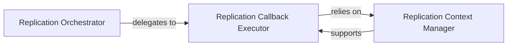

## Details

The `PyTorch DataParallel Integration` subsystem is a specialized layer within the `Synchronized-BatchNorm-PyTorch` project. Its primary responsibility is to seamlessly integrate the custom synchronized batch normalization logic with PyTorch's native `nn.DataParallel` module. This involves intercepting or modifying the standard model and data replication process to ensure that batch statistics are correctly gathered, synchronized, and applied across all distributed devices, thereby enabling accurate training in multi-GPU environments.

### Replication Orchestrator
Serves as the primary entry point for initiating and managing the replication of neural network models and input data across multiple devices, specifically tailored for integration with PyTorch's `nn.DataParallel`. It ensures that the model and data are correctly distributed for synchronized operations. This component acts as the high-level coordinator for the replication process, overriding or extending PyTorch's default behavior to incorporate synchronized batch normalization.

**Related Classes/Methods**:

- <a href="https://github.com/vacancy/Synchronized-BatchNorm-PyTorch/blob/master/sync_batchnorm/replicate.py" target="_blank" rel="noopener noreferrer">`sync_batchnorm.replicate:replicate`</a>
- <a href="https://github.com/vacancy/Synchronized-BatchNorm-PyTorch/blob/master/sync_batchnorm/replicate.py" target="_blank" rel="noopener noreferrer">`sync_batchnorm.replicate:new_replicate`</a>

### Replication Callback Executor
Executes a series of predefined actions or adjustments (callbacks) during the model and data replication process. This component is crucial for ensuring that specific operations, such as the synchronization of batch normalization statistics, are performed consistently and correctly across all replicated modules, adhering to the distributed training requirements. It embodies the "extension/plugin" pattern, allowing custom logic to be injected into the standard replication flow.

**Related Classes/Methods**:

- <a href="https://github.com/vacancy/Synchronized-BatchNorm-PyTorch/blob/master/sync_batchnorm/replicate.py" target="_blank" rel="noopener noreferrer">`sync_batchnorm.replicate:execute_replication_callbacks`</a>

### Replication Context Manager
Provides and manages the contextual information and state required by the replication callbacks. It ensures that the necessary data and environment (e.g., device information, module references) are available for the `Replication Callback Executor` to perform its operations effectively during the distributed training process, maintaining consistency across devices. This component is essential for maintaining state and providing necessary data to the callback execution, ensuring that distributed operations have the correct context.

**Related Classes/Methods**:

- <a href="https://github.com/vacancy/Synchronized-BatchNorm-PyTorch/blob/master/sync_batchnorm/replicate.py" target="_blank" rel="noopener noreferrer">`sync_batchnorm.replicate:CallbackContext`</a>

### [FAQ](https://github.com/CodeBoarding/GeneratedOnBoardings/tree/main?tab=readme-ov-file#faq)