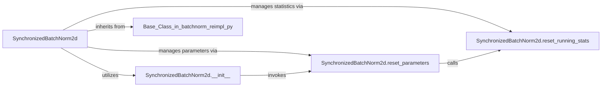

## Details

The `SynchronizedBatchNorm2d` subsystem is designed around a central `SynchronizedBatchNorm2d` component, which acts as the primary interface for integrating synchronized batch normalization into PyTorch models. This component, defined in `sync_batchnorm/batchnorm.py`, leverages an intentional architectural pattern where its core functionalities, including initialization (`__init__`) and parameter management (`reset_parameters`, `reset_running_stats`), are inherited or re-implemented from a base class residing in `sync_batchnorm/batchnorm_reimpl.py`. This separation of concerns allows `batchnorm.py` to provide a clean, user-facing API, while `batchnorm_reimpl.py` encapsulates the detailed, potentially specialized, logic for distributed batch normalization. The interaction pathways highlight `SynchronizedBatchNorm2d`'s reliance on these inherited methods for its operational lifecycle, ensuring proper setup and statistical management crucial for distributed training environments.

### SynchronizedBatchNorm2d
This is the central component that encapsulates the entire synchronized batch normalization layer. It provides the interface for integrating synchronized batch normalization into PyTorch models, managing the layer's state, and orchestrating the underlying mathematical operations for distributed training. It adheres to the ML Toolkit/Library pattern by providing a self-contained, swappable module for enhanced normalization. This class, defined in `sync_batchnorm/batchnorm.py`, inherits its core method implementations from a base class (likely `_SynchronizedBatchNorm`) located in `sync_batchnorm/batchnorm_reimpl.py`, representing an intentional architectural choice for modularity and specialized implementation.

**Related Classes/Methods**:

- <a href="https://github.com/vacancy/Synchronized-BatchNorm-PyTorch/blob/master/sync_batchnorm/batchnorm.py#L231-L290" target="_blank" rel="noopener noreferrer">`SynchronizedBatchNorm2d`:231-290</a>

### SynchronizedBatchNorm2d.__init__
As the primary entry point for creating a synchronized batch normalization layer, this component orchestrates the foundational setup. It ensures the layer's parameters are correctly prepared for operation, adhering to the modularity expected in an ML toolkit. This method, likely inherited or re-implemented from a base class in `sync_batchnorm/batchnorm_reimpl.py`, is crucial for establishing the initial state of the normalization process.

**Related Classes/Methods**:

- <a href="https://github.com/vacancy/Synchronized-BatchNorm-PyTorch/blob/master/sync_batchnorm/batchnorm_reimpl.py" target="_blank" rel="noopener noreferrer">`SynchronizedBatchNorm2d.__init__`</a>

### SynchronizedBatchNorm2d.reset_parameters
This component is responsible for the initial setup and resetting of the learnable parameters (e.g., weights and biases) of the batch normalization layer. This method, likely inherited or re-implemented from a base class in `sync_batchnorm/batchnorm_reimpl.py`, is crucial for establishing a consistent starting state for the normalization process, a common pattern in ML libraries for reproducibility and proper model initialization.

**Related Classes/Methods**:

- <a href="https://github.com/vacancy/Synchronized-BatchNorm-PyTorch/blob/master/sync_batchnorm/batchnorm_reimpl.py" target="_blank" rel="noopener noreferrer">`SynchronizedBatchNorm2d.reset_parameters`</a>

### SynchronizedBatchNorm2d.reset_running_stats
This component specifically handles the initialization or resetting of the running mean and variance statistics. These statistics are paramount for the synchronized aspect of batch normalization, as they accumulate information across different devices during distributed training, directly supporting the "flow of data/statistics" architectural bias. This method is likely inherited or re-implemented from a base class in `sync_batchnorm/batchnorm_reimpl.py`.

**Related Classes/Methods**:

- <a href="https://github.com/vacancy/Synchronized-BatchNorm-PyTorch/blob/master/sync_batchnorm/batchnorm_reimpl.py" target="_blank" rel="noopener noreferrer">`SynchronizedBatchNorm2d.reset_running_stats`</a>

### [FAQ](https://github.com/CodeBoarding/GeneratedOnBoardings/tree/main?tab=readme-ov-file#faq)