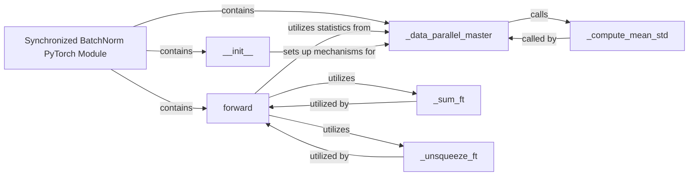

## Details

The subsystem under analysis is the `Synchronized BatchNorm PyTorch Module`, which encompasses the core logic and components responsible for performing batch normalization across multiple GPUs in a synchronized manner within a PyTorch deep learning model. Its boundaries are defined by the `sync_batchnorm` package, specifically focusing on the `batchnorm.py` and `batchnorm_reimpl.py` files.

### Synchronized BatchNorm PyTorch Module [[Expand]](./Synchronized_BatchNorm_PyTorch_Module.md)
The primary user-facing `torch.nn.Module` that integrates synchronized batch normalization into deep learning models. It acts as the central orchestrator, encapsulating the logic for performing batch normalization across multiple GPUs. This aligns with the "Core Synchronized BatchNorm Modules" pattern, offering a modular, drop-in replacement for standard BatchNorm.

**Related Classes/Methods**:

- <a href="https://github.com/vacancy/Synchronized-BatchNorm-PyTorch/blob/master/sync_batchnorm/batchnorm.py" target="_blank" rel="noopener noreferrer">`sync_batchnorm.batchnorm.SynchronizedBatchNorm`</a>

### _data_parallel_master
This component is crucial for the "Data Parallel Integration Layer" and "Flow of data/statistics" patterns. It manages the master-side operations during data parallelism, coordinating the collection and aggregation of batch statistics (mean and variance) from all participating GPUs to ensure global consistency.

**Related Classes/Methods**:

- <a href="https://github.com/vacancy/Synchronized-BatchNorm-PyTorch/blob/master/sync_batchnorm/batchnorm.py" target="_blank" rel="noopener noreferrer">`sync_batchnorm.batchnorm.SynchronizedBatchNorm._data_parallel_master`</a>

### forward
This is the core operational component that executes the forward pass of the synchronized batch normalization. It applies the normalization transformation to the input features using the globally synchronized statistics. This directly reflects the "Impact on training pipeline" by modifying the standard PyTorch forward pass for multi-GPU scenarios.

**Related Classes/Methods**:

- <a href="https://github.com/vacancy/Synchronized-BatchNorm-PyTorch/blob/master/sync_batchnorm/batchnorm_reimpl.py" target="_blank" rel="noopener noreferrer">`sync_batchnorm.batchnorm.SynchronizedBatchNorm.forward`</a>

### __init__
Responsible for the initial setup and configuration of the synchronized batch normalization module. This includes preparing the module for data-parallel operations and initializing parameters, aligning with the "Integration mechanisms" pattern.

**Related Classes/Methods**:

- <a href="https://github.com/vacancy/Synchronized-BatchNorm-PyTorch/blob/master/sync_batchnorm/batchnorm.py" target="_blank" rel="noopener noreferrer">`sync_batchnorm.batchnorm.SynchronizedBatchNorm.__init__`</a>

### _compute_mean_std
A utility component critical for the "Flow of data/statistics" pattern. It calculates the mean and standard deviation of features across a local batch, which are then aggregated globally.

**Related Classes/Methods**:

- <a href="https://github.com/vacancy/Synchronized-BatchNorm-PyTorch/blob/master/sync_batchnorm/batchnorm.py" target="_blank" rel="noopener noreferrer">`sync_batchnorm.batchnorm.SynchronizedBatchNorm._compute_mean_std`</a>

### _sum_ft
A low-level helper component that performs specific tensor manipulations (summation) required during the forward pass or statistic computation. It supports the "Flow of data/statistics" by preparing tensors for aggregation or application.

**Related Classes/Methods**:

- <a href="https://github.com/vacancy/Synchronized-BatchNorm-PyTorch/blob/master/sync_batchnorm/batchnorm_reimpl.py" target="_blank" rel="noopener noreferrer">`sync_batchnorm.batchnorm_reimpl._sum_ft`</a>

### _unsqueeze_ft
A low-level helper component that performs specific tensor manipulations (unsqueezing features) required during the forward pass or statistic computation. It supports the "Flow of data/statistics" by preparing tensors for aggregation or application.

**Related Classes/Methods**:

- <a href="https://github.com/vacancy/Synchronized-BatchNorm-PyTorch/blob/master/sync_batchnorm/batchnorm_reimpl.py" target="_blank" rel="noopener noreferrer">`sync_batchnorm.batchnorm_reimpl._unsqueeze_ft`</a>

### [FAQ](https://github.com/CodeBoarding/GeneratedOnBoardings/tree/main?tab=readme-ov-file#faq)