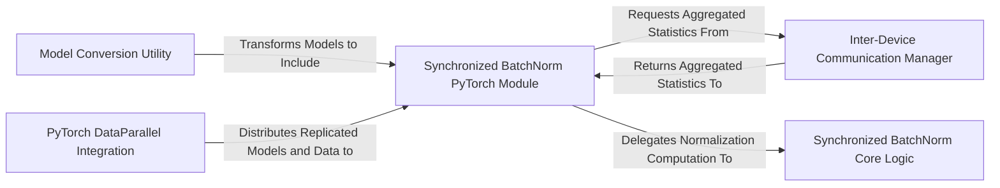

## Details

The `Synchronized-BatchNorm-PyTorch` library is designed as an enhancement layer for PyTorch's distributed training capabilities. Its architecture centers around the `Synchronized BatchNorm PyTorch Module`, which acts as the orchestrator for synchronized normalization. This module leverages the `PyTorch DataParallel Integration` for model and data distribution, and the `Inter-Device Communication Manager` for efficient cross-GPU aggregation of batch statistics. The actual normalization computations are delegated to the `Synchronized BatchNorm Core Logic`. A `Model Conversion Utility` simplifies the adoption by automatically replacing standard batch normalization layers. This modular design ensures that the library seamlessly integrates into existing PyTorch training pipelines, providing robust and accurate batch normalization in multi-GPU environments by synchronizing statistics across all devices before applying them.

### Synchronized BatchNorm PyTorch Module [[Expand]](./Synchronized_BatchNorm_PyTorch_Module.md)
The primary user-facing `torch.nn.Module` that integrates synchronized batch normalization into deep learning models. It orchestrates the overall process, coordinating with other components.

**Related Classes/Methods**:

- <a href="https://github.com/vacancy/Synchronized-BatchNorm-PyTorch/blob/master/sync_batchnorm/batchnorm.py" target="_blank" rel="noopener noreferrer">`sync_batchnorm.batchnorm`</a>
- <a href="https://github.com/vacancy/Synchronized-BatchNorm-PyTorch/blob/master/sync_batchnorm/batchnorm.py#L121-L142" target="_blank" rel="noopener noreferrer">`_data_parallel_master`:121-142</a>
- <a href="https://github.com/vacancy/Synchronized-BatchNorm-PyTorch/blob/master/sync_batchnorm/batchnorm_reimpl.py#L48-L73" target="_blank" rel="noopener noreferrer">`forward`:48-73</a>

### Synchronized BatchNorm Core Logic [[Expand]](./Synchronized_BatchNorm_Core_Logic.md)
Encapsulates the fundamental mathematical operations for synchronized batch normalization, including the calculation and management of running mean and variance across devices.

**Related Classes/Methods**:

- <a href="https://github.com/vacancy/Synchronized-BatchNorm-PyTorch/blob/master/sync_batchnorm/batchnorm_reimpl.py#L27-L37" target="_blank" rel="noopener noreferrer">`__init__`:27-37</a>

### Inter-Device Communication Manager [[Expand]](./Inter_Device_Communication_Manager.md)
Facilitates the aggregation and distribution of batch statistics (mean, variance, counts) across multiple GPUs, implementing a master-slave communication pattern.

**Related Classes/Methods**:

- <a href="https://github.com/vacancy/Synchronized-BatchNorm-PyTorch/blob/master/sync_batchnorm/comm.py#L102-L133" target="_blank" rel="noopener noreferrer">`run_master`:102-133</a>
- <a href="https://github.com/vacancy/Synchronized-BatchNorm-PyTorch/blob/master/sync_batchnorm/comm.py#L18-L39" target="_blank" rel="noopener noreferrer">`FutureResult`:18-39</a>

### PyTorch DataParallel Integration [[Expand]](./PyTorch_DataParallel_Integration.md)
Manages the replication of neural network models and input data across different devices, ensuring consistency and proper execution within PyTorch's `nn.DataParallel` framework.

**Related Classes/Methods**:

- <a href="https://github.com/vacancy/Synchronized-BatchNorm-PyTorch/blob/master/sync_batchnorm/replicate.py#L64-L67" target="_blank" rel="noopener noreferrer">`replicate`:64-67</a>
- <a href="https://github.com/vacancy/Synchronized-BatchNorm-PyTorch/blob/master/sync_batchnorm/replicate.py#L88-L92" target="_blank" rel="noopener noreferrer">`new_replicate`:88-92</a>

### Model Conversion Utility
Provides a utility function to automatically traverse an existing PyTorch model and replace standard `nn.BatchNorm` layers with instances of the `Synchronized BatchNorm PyTorch Module`.

**Related Classes/Methods**:

- <a href="https://github.com/vacancy/Synchronized-BatchNorm-PyTorch/blob/master/sync_batchnorm/batchnorm.py#L371-L412" target="_blank" rel="noopener noreferrer">`convert_model`:371-412</a>

### [FAQ](https://github.com/CodeBoarding/GeneratedOnBoardings/tree/main?tab=readme-ov-file#faq)