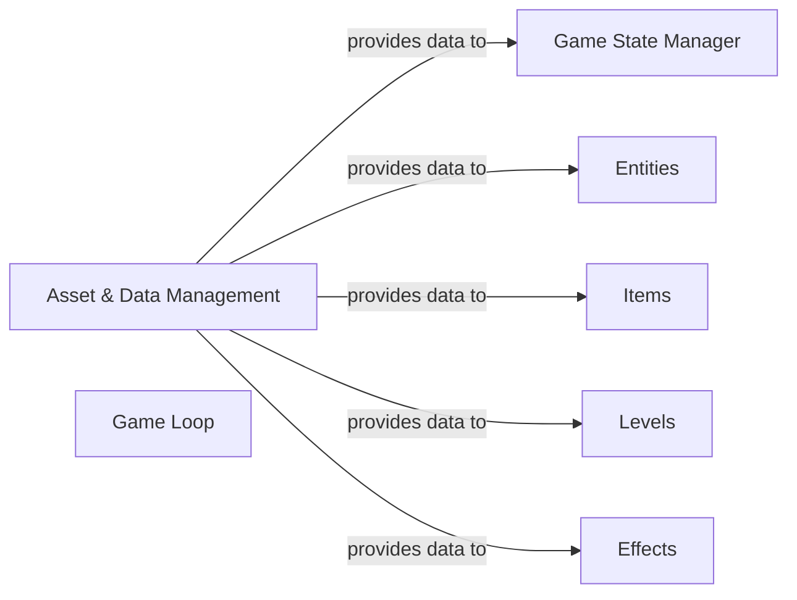

## Details

Abstract Components Overview and Relationships for a Game System

### Asset & Data Management [[Expand]](./Asset_Data_Management.md)
This component is responsible for the robust loading, validation, and centralized management of all static game assets, including Entities, Effects, Levels, and Items. It parses JSON configuration files, ensures data integrity against predefined schemas, and provides structured, accessible game data to other core components, acting as the single source of truth for game definitions. This aligns with the "Data-Driven Design" pattern, centralizing asset definitions and ensuring extensibility.

**Related Classes/Methods**:

- <a href="https://github.com/HilkopterBob/TA/blob/main/Assethandler.py#L1-L1" target="_blank" rel="noopener noreferrer">`Assethandler.py` (1:1)</a>

### Game Loop
The central orchestrator of the game, responsible for driving the game's execution cycle. It manages the sequence of operations for each frame, typically including input processing, game state updates, and rendering. It ensures a consistent and continuous flow of the game.

**Related Classes/Methods**: _None_

### Game State Manager
Manages the overall flow and current state of the game (e.g., main menu, playing, paused, game over). It handles transitions between different game states, orchestrates the loading and unloading of game resources pertinent to the current state, and may manage game save/load operations.

**Related Classes/Methods**: _None_

### Entities
Represents all active, interactive objects within the game world, such as players, non-player characters (NPCs), enemies, and dynamic environmental elements. This component manages their properties, behaviors, and interactions within the game simulation.

**Related Classes/Methods**: _None_

### Items
Manages all collectible, usable, or equippable objects within the game. This includes defining their properties, effects, and how they interact with entities and the game world.

**Related Classes/Methods**: _None_

### Levels
Defines the structure, layout, and content of specific game environments or stages. This component is responsible for loading and managing the geometry, static objects, and initial entity placements for each distinct game area.

**Related Classes/Methods**: _None_

### Effects
Handles the creation, management, and rendering of visual and auditory effects within the game, such as particle systems, animations, sound effects, and post-processing effects. It enhances the player's sensory experience and provides feedback for in-game events.

**Related Classes/Methods**: _None_

### [FAQ](https://github.com/CodeBoarding/GeneratedOnBoardings/tree/main?tab=readme-ov-file#faq)