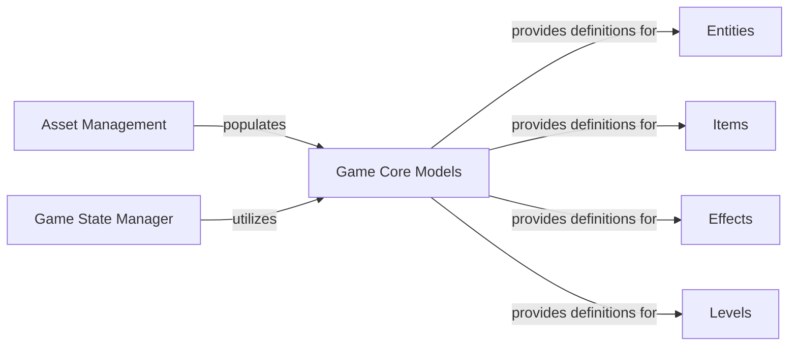

## Details

Abstract Components Overview

### Game Core Models [[Expand]](./Game_Core_Models.md)
This component defines the foundational in-memory data structures and initial properties (blueprints/schemas) for all fundamental game elements. This includes entities (players, NPCs, monsters), items, effects, and level layouts. These models encapsulate the static properties and basic behaviors of game objects, serving as the in-memory representation of game data loaded from external sources (e.g., JSON). They act as templates for creating active game objects during gameplay.

**Related Classes/Methods**:

- `LevelInit` (1:1)
- `EntityInit` (1:1)
- `EffectInit` (1:1)
- `ItemInit` (1:1)

### Asset Management
This component is responsible for discovering, loading, and parsing game assets from the file system, specifically JSON files. It orchestrates the import process for various asset types (levels, entities, items, effects) and makes them available for the game.

**Related Classes/Methods**:

- `AssetHandler` (1:1)
- `AssetHandler:load_game` (1:1)
- `AssetHandler:getFiles` (1:1)
- `AssetHandler:importLevels` (1:1)
- `AssetHandler:importEntities` (1:1)
- `AssetHandler:importItems` (1:1)
- `AssetHandler:importEffects` (1:1)

### Game State Manager
This component is intended to manage the overall runtime state of the game, including the active levels, entities, and their interactions. While a dedicated "Game State Manager" class was not explicitly found in the provided source, the AssetHandler indirectly contributes to the initial game state by loading all necessary assets at game startup. Further analysis would be required to identify the specific component responsible for dynamic game state management during gameplay.

**Related Classes/Methods**: _None_

### Entities
This component focuses on the definition, loading, and initial instantiation of all entity-related game objects, such as players, NPCs, and monsters. It provides the mechanisms to parse entity data from external sources and create in-memory representations.

**Related Classes/Methods**:

- `EntityInit` (1:1)
- `load_entities_fromjson` (1:1)
- `load_entities_by_name_from_json` (1:1)

### Items
This component handles the definition, loading, and initial instantiation of all item-related game objects, including weapons, armor, consumables, and quest items. It provides the functionality to parse item data from external sources and create in-memory representations.

**Related Classes/Methods**:

- `itemInit` (1:1)
- `load_all_items_from_json` (1:1)
- `load_item_by_name_from_json` (1:1)

### Effects
This component manages the definition, loading, and initial instantiation of all in-game effects, such as buffs, debuffs, and status ailments. It provides the mechanisms to parse effect data from external sources and create in-memory representations.

**Related Classes/Methods**:

- `EffectInit` (1:1)
- `load_all_effects_from_json` (1:1)
- `load_effect_by_name_from_json` (1:1)

### Levels
This component is responsible for the definition, loading, and initial instantiation of all game levels or maps. It provides the functionality to parse level layout and content data from external sources and create in-memory representations of the game world.

**Related Classes/Methods**:

- `LevelInit` (1:1)
- `load_all_levels_from_json` (1:1)
- `load_level_by_name_from_json` (1:1)

### [FAQ](https://github.com/CodeBoarding/GeneratedOnBoardings/tree/main?tab=readme-ov-file#faq)