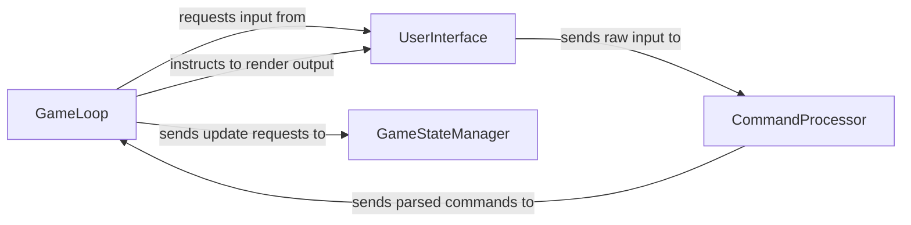

## Details

One paragraph explaining the functionality which is represented by this graph. What the main flow is and what is its purpose.

### GameLoop
The central orchestrator of the game. It continuously handles user input, interprets commands, dispatches actions to update the game state based on game logic, and triggers rendering of the game world. This component embodies the core "Game Loop" and acts as the primary coordinator for the entire game flow.

**Related Classes/Methods**:

- `GameLoop` (1:1)

### CommandProcessor
Interprets raw user input into actionable game commands. It validates the input against defined game actions and dispatches the parsed commands to the appropriate game logic for execution. This component directly implements the "Interpreter Pattern" by translating user text into structured commands.

**Related Classes/Methods**:

- `CommandProcessor` (1:1)

### UserInterface
Manages all interactions with the user, including receiving raw input and displaying game output. It acts as the bridge between the player and the game's internal logic, providing the necessary input for command processing and rendering the game state back to the player.

**Related Classes/Methods**:

- `UserInterface` (1:1)

### GameStateManager
Responsible for maintaining and updating the current state of the game world, including all entities, items, levels, and active effects. It acts as the authoritative source for game data and responds to requests from the `GameLoop` to modify the game state based on player actions or game events.

**Related Classes/Methods**:

- `GameStateManager` (1:1)

### [FAQ](https://github.com/CodeBoarding/GeneratedOnBoardings/tree/main?tab=readme-ov-file#faq)