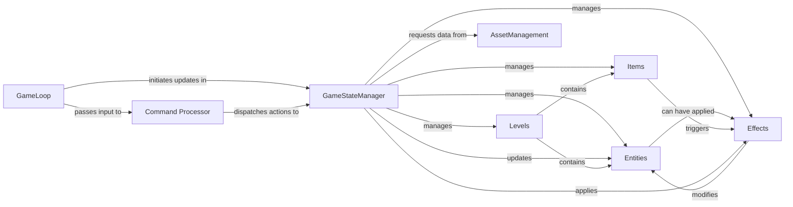

## Details

Abstract Components Overview of a Game Project

### GameStateManager
The central component responsible for managing the overall dynamic state of the game. This includes player status, current location, inventory, active effects, and quest progress. It encapsulates core game rules, applies effects, and manages relationships between all game elements.

**Related Classes/Methods**:

- `GameStateManager` (1:100)

### Entities
Represents all active game characters (player, NPCs) and potentially interactive objects within the game world. Each entity encapsulates its attributes (e.g., health, stats, inventory) and defines its behaviors.

**Related Classes/Methods**:

- <a href="https://github.com/HilkopterBob/TA/blob/main/Entities.py#L1-L100" target="_blank" rel="noopener noreferrer">`Entities` (1:100)</a>

### Items
Defines all collectible, usable, or equipable items present in the game. This includes their properties (e.g., weight, value), effects when used, and usage rules.

**Related Classes/Methods**:

- <a href="https://github.com/HilkopterBob/TA/blob/main/Items.py#L1-L100" target="_blank" rel="noopener noreferrer">`Items` (1:100)</a>

### Levels
Structures the game world into distinct locations or areas. Each level defines its layout, available actions, contained entities, and items, providing the spatial context for gameplay.

**Related Classes/Methods**:

- `Levels` (1:100)

### Effects
Encapsulates temporary or permanent modifications that can be applied to entities or the environment. This includes buffs, debuffs, damage over time, status ailments, or environmental changes.

**Related Classes/Methods**:

- `Effects` (1:100)

### GameLoop
The central orchestrator of the entire game flow. It continuously handles user input, updates the game state based on actions and time, and triggers the rendering of output to the user.

**Related Classes/Methods**:

- `GameLoop` (1:100)

### AssetManagement
Responsible for loading, parsing, and validating all static game data assets (e.g., definitions of entities, items, levels, effects) from external data sources, typically JSON files.

**Related Classes/Methods**:

- `AssetManagement` (1:100)

### Command Processor
Interprets raw user input strings, validates them against known commands, and translates them into structured actions that can be dispatched to the GameStateManager or other relevant components.

**Related Classes/Methods**:

- `Command Processor` (1:100)

### [FAQ](https://github.com/CodeBoarding/GeneratedOnBoardings/tree/main?tab=readme-ov-file#faq)