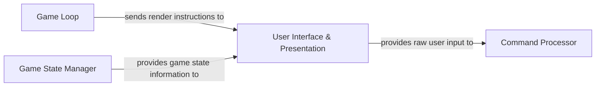

## Details

Abstract Components Overview for a Command-Line Interface (CLI) Role-Playing Game.

### User Interface & Presentation [[Expand]](./User_Interface_Presentation.md)
The User Interface & Presentation component serves as the primary interface for all player interactions within the Command-Line Interface (CLI) Role-Playing Game. It is solely responsible for rendering all game-related information, including formatted text, interactive menus, and progress indicators, to the user. Concurrently, it manages the reception of raw user input, acting as the initial point of contact for player commands and choices. This component translates the internal game state into a comprehensible and interactive experience for the player, leveraging specialized CLI libraries for rich text and input handling.

**Related Classes/Methods**:

- `UI` (1:1)
- `Outputhandler` (1:1)
- `Inputhandler` (1:1)

### Command Processor
The Command Processor component is responsible for receiving raw user input from the User Interface & Presentation component, parsing it, and translating it into actionable game commands. It validates the input against the current game context and dispatches the appropriate actions to other game systems.

**Related Classes/Methods**:

- `Inputhandler` (1:1)

### Game Loop
The Game Loop component orchestrates the main flow of the game, managing the sequence of events, including input processing, game state updates, and rendering instructions. It ensures the continuous progression of the game by repeatedly executing these core steps.

**Related Classes/Methods**:

- `Game` (1:1)
- `Engine` (1:1)

### Game State Manager
The Game State Manager component is responsible for maintaining and providing access to the current state of the game world, including player status, entity positions, inventory, and quest progress. It ensures data consistency and provides necessary information to other components for rendering and decision-making.

**Related Classes/Methods**:

- `Game` (1:1)
- `Player` (1:1)
- `World` (1:1)

### [FAQ](https://github.com/CodeBoarding/GeneratedOnBoardings/tree/main?tab=readme-ov-file#faq)