```mermaid
graph LR
    Asset_Data_Management["Asset & Data Management"]
    Game_Core_Models["Game Core Models"]
    Game_State_Logic["Game State & Logic"]
    Game_Loop_Command_Processing["Game Loop & Command Processing"]
    User_Interface_Presentation["User Interface & Presentation"]
    Asset_Data_Management -- "provides data to" --> Game_Core_Models
    Game_Core_Models -- "populated by" --> Asset_Data_Management
    Game_Core_Models -- "managed by" --> Game_State_Logic
    Game_State_Logic -- "manages" --> Game_Core_Models
    Game_State_Logic -- "provides state to" --> Game_Loop_Command_Processing
    Game_State_Logic -- "provides state to" --> User_Interface_Presentation
    Game_Loop_Command_Processing -- "updates" --> Game_State_Logic
    Game_Loop_Command_Processing -- "sends display data to" --> User_Interface_Presentation
    User_Interface_Presentation -- "sends input to" --> Game_Loop_Command_Processing
    click Asset_Data_Management href "https://github.com/CodeBoarding/GeneratedOnBoardings/blob/main/TA/Asset_Data_Management.md" "Details"
    click Game_Core_Models href "https://github.com/CodeBoarding/GeneratedOnBoardings/blob/main/TA/Game_Core_Models.md" "Details"
    click Game_State_Logic href "https://github.com/CodeBoarding/GeneratedOnBoardings/blob/main/TA/Game_State_Logic.md" "Details"
    click Game_Loop_Command_Processing href "https://github.com/CodeBoarding/GeneratedOnBoardings/blob/main/TA/Game_Loop_Command_Processing.md" "Details"
    click User_Interface_Presentation href "https://github.com/CodeBoarding/GeneratedOnBoardings/blob/main/TA/User_Interface_Presentation.md" "Details"
```

## Details

Abstract Components Overview for a game project.

### Asset & Data Management [[Expand]](./Asset_Data_Management.md)
Centralized system for loading, validating, and managing all static game assets (Entities, Effects, Levels, Items) from JSON files. It ensures data integrity and provides structured access to game data for other components.

**Related Classes/Methods**:

- `AssetHandler`
- `load_game`

### Game Core Models [[Expand]](./Game_Core_Models.md)
Represents the in-memory data structures for all fundamental game elements, including entities (players, NPCs, monsters), items, effects, and level definitions. These models encapsulate the properties and basic behaviors of game objects.

**Related Classes/Methods**:

- `LevelInit`
- `EntityInit`
- `EffectInit`
- `itemInit`

### Game State & Logic [[Expand]](./Game_State_Logic.md)
Manages the overall dynamic state of the game, including player status, current location, inventory, active effects, and quest progress. It encapsulates the core game rules and interactions, applying effects and managing relationships between game elements.

**Related Classes/Methods**: _None_

### Game Loop & Command Processing [[Expand]](./Game_Loop_Command_Processing.md)
The central orchestrator of the game. It continuously handles user input, interprets commands, dispatches actions to update the game state based on game logic, and triggers rendering of the game world. This component embodies the core "Game Loop" and "Interpreter Pattern."

**Related Classes/Methods**: _None_

### User Interface & Presentation [[Expand]](./User_Interface_Presentation.md)
Handles all interactions with the user, including displaying game information (formatted text, menus, progress indicators) and receiving user input. It renders the game world based on data received from the Game State & Logic and Game Loop.

**Related Classes/Methods**: _None_

### [FAQ](https://github.com/CodeBoarding/GeneratedOnBoardings/tree/main?tab=readme-ov-file#faq)