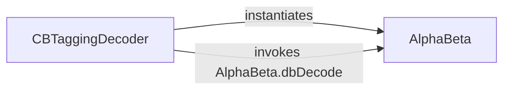

## Details

The analysis confirms an explicit interaction pathway between `CBTaggingDecoder` and `AlphaBeta`. `CBTaggingDecoder` instantiates `AlphaBeta` and invokes its `dbDecode` method within its `dp` method for optimal sequence decoding. This establishes `CBTaggingDecoder` as the central control unit for character-based segmentation and tagging, delegating optimal sequence decoding to `AlphaBeta`.

### CBTaggingDecoder
This component serves as the primary orchestrator for character-based segmentation and part-of-speech tagging. It is responsible for preparing input features, executing dynamic programming algorithms (e.g., Viterbi-like decoding) to find the most probable tag sequence, and managing the overall flow of the tagging process. Its methods like `segmentTag`, `putValues`, and `dp` indicate its role in state management and sequence generation.

**Related Classes/Methods**:

### AlphaBeta
This component implements the Alpha-Beta decoding algorithm, which is crucial for refining the output generated by the `CBTaggingDecoder`. Its primary responsibility is to ensure optimal sequence decoding by efficiently pruning less promising paths in the search space, thereby enhancing the accuracy and performance of the final tagging result. The `dbDecode` method is central to this optimization.

**Related Classes/Methods**:

### [FAQ](https://github.com/CodeBoarding/GeneratedOnBoardings/tree/main?tab=readme-ov-file#faq)