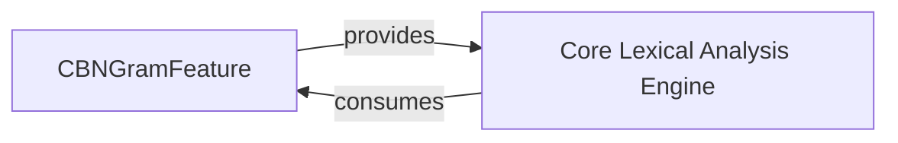

## Details

The `Feature Generation Module`, primarily embodied by `CBNGramFeature`, serves as a foundational component responsible for creating character-based N-gram features. It orchestrates the entire feature lifecycle, from base unit extraction to value aggregation. This module directly supports the `Core Lexical Analysis Engine` by providing it with the essential N-gram features, enabling subsequent lexical analysis. The interaction pathway involves the `Core Lexical Analysis Engine` consuming features generated by `CBNGramFeature`, highlighting a clear producer-consumer relationship within the system.

### CBNGramFeature
This class is the core of the Feature Generation Module. It is responsible for the entire lifecycle of character-based N-gram feature creation. It acts as the primary interface for other modules (e.g., Core Lexical Analysis Engine) to obtain these features. Its responsibilities include: Orchestration of Feature Generation, Base Unit Extraction, Feature Value Aggregation/Storage.

**Related Classes/Methods**:

- <a href="https://github.com/thunlp/THULAC-Python/blob/master/thulac/character/CBNGramFeature.py" target="_blank" rel="noopener noreferrer">`CBNGramFeature:putValues`</a>
- <a href="https://github.com/thunlp/THULAC-Python/blob/master/thulac/character/CBNGramFeature.py" target="_blank" rel="noopener noreferrer">`CBNGramFeature:findBases`</a>
- <a href="https://github.com/thunlp/THULAC-Python/blob/master/thulac/character/CBNGramFeature.py" target="_blank" rel="noopener noreferrer">`CBNGramFeature:addValues`</a>

### Core Lexical Analysis Engine [[Expand]](./Core_Lexical_Analysis_Engine.md)
This component is responsible for performing lexical analysis, utilizing the character-based N-gram features provided by the `CBNGramFeature` module. It processes these features to derive linguistic insights or prepare data for further processing.

**Related Classes/Methods**: _None_

### [FAQ](https://github.com/CodeBoarding/GeneratedOnBoardings/tree/main?tab=readme-ov-file#faq)