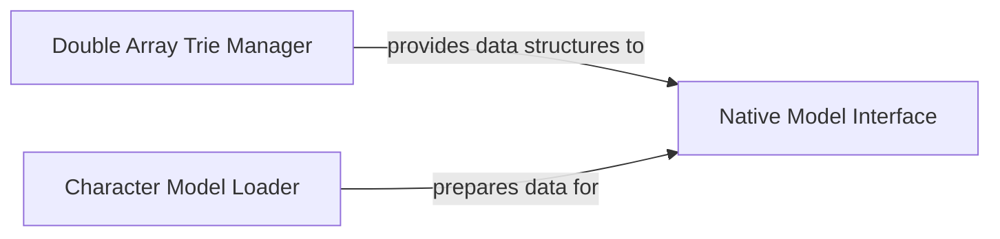

## Details

The `Model & Data Management` subsystem is a critical part of the THULAC project, responsible for the efficient loading, initialization, and access of pre-trained linguistic models and their underlying data structures. It acts as the backbone for providing the core NLP engine with the necessary linguistic resources.

### Double Array Trie Manager
This component is responsible for the creation, allocation, population, and optimization of Double Array Trie (DAT) data structures. It provides core functionalities for efficient dictionary lookups and pattern matching, which are essential for lexical analysis.

**Related Classes/Methods**:

- <a href="https://github.com/thunlp/THULAC-Python/blob/master/thulac/base/Dat.py" target="_blank" rel="noopener noreferrer">`thulac.base.Dat`</a>

### Character Model Loader
This component specializes in the initial loading and preprocessing of character-based linguistic models. Its primary function involves converting raw byte data from model files into an internal integer representation suitable for the model's processing. It acts as a dedicated loader and preprocessor for specific model types.

**Related Classes/Methods**:

- <a href="https://github.com/thunlp/THULAC-Python/blob/master/thulac/character/CBModel.py" target="_blank" rel="noopener noreferrer">`thulac.character.CBModel`</a>

### Native Model Interface
This component serves as a Foreign Function Interface (FFI) to a native shared library (`libthulac.so`). It manages the initialization (`init`), deinitialization (`deinit`), and core segmentation (`seg`) operations by invoking functions within the native library. It acts as a crucial bridge, allowing the Python application to leverage performance-critical model logic potentially implemented in C/C++.

**Related Classes/Methods**:

- <a href="https://github.com/thunlp/THULAC-Python/blob/master/thulac/manage/SoExtention.py" target="_blank" rel="noopener noreferrer">`thulac.manage.SoExtention`</a>

### [FAQ](https://github.com/CodeBoarding/GeneratedOnBoardings/tree/main?tab=readme-ov-file#faq)