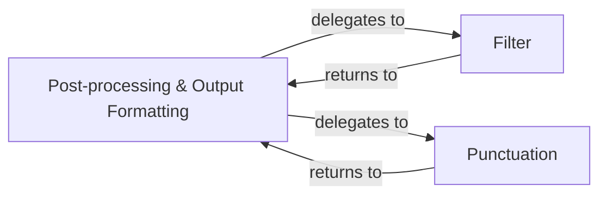

## Details

The Post-processing & Output Formatting subsystem handles the refinement and final preparation of lexical analysis results, encompassing Postprocesser.py, Filter.py, and Punctuation.py modules.

### Post-processing & Output Formatting [[Expand]](./Post_processing_Output_Formatting.md)
This is the orchestrating component of the subsystem. It takes the raw output from the Core Lexical Analysis Engine and applies a series of post-tagging rules, coordinates filtering operations, and formats the final results for consumption. It acts as the primary interface for the overall post-processing pipeline.

**Related Classes/Methods**:

- <a href="https://github.com/thunlp/THULAC-Python/blob/master/thulac/manage/Postprocesser.py" target="_blank" rel="noopener noreferrer">`thulac/manage/Postprocesser.py`</a>

### Filter
Responsible for implementing specific filtering logic. This component removes or modifies tokens and tags based on predefined criteria, ensuring that only relevant or desired elements are retained in the final output. It encapsulates the rules and mechanisms for data reduction or refinement.

**Related Classes/Methods**:

- <a href="https://github.com/thunlp/THULAC-Python/blob/master/thulac/manage/Filter.py" target="_blank" rel="noopener noreferrer">`thulac/manage/Filter.py`</a>

### Punctuation
This component specializes in the handling of punctuation within the processed text. Its responsibilities include normalization (e.g., converting full-width to half-width characters), removal, or applying special processing rules to punctuation marks, which can significantly impact downstream tasks.

**Related Classes/Methods**:

- <a href="https://github.com/thunlp/THULAC-Python/blob/master/thulac/manage/Punctuation.py" target="_blank" rel="noopener noreferrer">`thulac/manage/Punctuation.py`</a>

### [FAQ](https://github.com/CodeBoarding/GeneratedOnBoardings/tree/main?tab=readme-ov-file#faq)