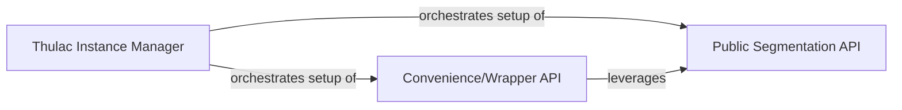

## Details

The THULAC Public API subsystem serves as the primary user-facing interface and orchestrator for the THULAC text processing pipeline. It is primarily defined by the `thulac/__init__.py` module, which encapsulates the core functionalities and their exposure to external users.

### Thulac Instance Manager
This component is responsible for the lifecycle management and initial configuration of the THULAC instance. It handles the setup of internal states, including paths and prefixes, ensuring the environment is correctly prepared for text processing operations. It acts as the foundational orchestrator for the entire API.

**Related Classes/Methods**:

- <a href="https://github.com/thunlp/THULAC-Python/blob/master/thulac/__init__.py" target="_blank" rel="noopener noreferrer">`thulac.__init__`</a>
- <a href="https://github.com/thunlp/THULAC-Python/blob/master/thulac/__init__.py" target="_blank" rel="noopener noreferrer">`thulac.__setPrefix`</a>

### Public Segmentation API
This component provides the fundamental, direct methods for text segmentation (`cut`, `fast_cut`). It represents the core interface through which users access THULAC's primary text processing capabilities. It is the direct entry point for raw text segmentation.

**Related Classes/Methods**:

- <a href="https://github.com/thunlp/THULAC-Python/blob/master/thulac/__init__.py" target="_blank" rel="noopener noreferrer">`thulac.cut`</a>
- <a href="https://github.com/thunlp/THULAC-Python/blob/master/thulac/__init__.py" target="_blank" rel="noopener noreferrer">`thulac.fast_cut`</a>

### Convenience/Wrapper API
This component offers higher-level abstractions and utility methods (`run`, `cut_f`, `fast_cut_f`, `cutline`, `func_cutline`) designed to simplify common usage patterns. It builds upon the core segmentation capabilities to facilitate tasks like processing entire files or handling text line-by-line, enhancing overall usability.

**Related Classes/Methods**:

- <a href="https://github.com/thunlp/THULAC-Python/blob/master/thulac/__init__.py" target="_blank" rel="noopener noreferrer">`thulac.run`</a>
- <a href="https://github.com/thunlp/THULAC-Python/blob/master/thulac/__init__.py" target="_blank" rel="noopener noreferrer">`thulac.cut_f`</a>
- <a href="https://github.com/thunlp/THULAC-Python/blob/master/thulac/__init__.py" target="_blank" rel="noopener noreferrer">`thulac.fast_cut_f`</a>
- <a href="https://github.com/thunlp/THULAC-Python/blob/master/thulac/__init__.py" target="_blank" rel="noopener noreferrer">`thulac.cutline`</a>
- <a href="https://github.com/thunlp/THULAC-Python/blob/master/thulac/__init__.py" target="_blank" rel="noopener noreferrer">`thulac.func_cutline`</a>

### [FAQ](https://github.com/CodeBoarding/GeneratedOnBoardings/tree/main?tab=readme-ov-file#faq)