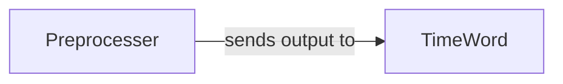

## Details

The `Text Preprocessing Module` is responsible for the initial stages of preparing raw input text for further NLP processing. Its primary functions include character encoding handling, normalization, and specific transformations like Traditional-to-Simplified Chinese conversion. It acts as the first layer in the NLP pipeline, ensuring data consistency and quality before lexical analysis.

### Preprocesser
This component serves as the initial entry point for raw text. It performs fundamental cleaning and normalization, with a critical focus on converting Traditional Chinese characters to Simplified Chinese. This ensures a consistent character set for downstream processing, which is essential for a robust NLP toolkit. It also handles basic character and string manipulations.

**Related Classes/Methods**:

- <a href="https://github.com/thunlp/THULAC-Python/blob/master/thulac/manage/Preprocesser.py" target="_blank" rel="noopener noreferrer">`thulac/manage/Preprocesser.py`</a>
- <a href="https://github.com/thunlp/THULAC-Python/blob/master/thulac/manage/Preprocesser.py" target="_blank" rel="noopener noreferrer">`thulac/manage/Preprocesser.py:clean`</a>
- <a href="https://github.com/thunlp/THULAC-Python/blob/master/thulac/manage/Preprocesser.py" target="_blank" rel="noopener noreferrer">`thulac/manage/Preprocesser.py:T2S`</a>
- <a href="https://github.com/thunlp/THULAC-Python/blob/master/thulac/manage/Preprocesser.py" target="_blank" rel="noopener noreferrer">`thulac/manage/Preprocesser.py:getT2S`</a>
- <a href="https://github.com/thunlp/THULAC-Python/blob/master/thulac/manage/Preprocesser.py" target="_blank" rel="noopener noreferrer">`thulac/manage/Preprocesser.py:is_X`</a>
- <a href="https://github.com/thunlp/THULAC-Python/blob/master/thulac/manage/Preprocesser.py" target="_blank" rel="noopener noreferrer">`thulac/manage/Preprocesser.py:isPossibleTitle`</a>

### TimeWord
This component specializes in fine-tuning text segments and tags by identifying and normalizing specific linguistic patterns such as time expressions, Arabic numerals, and URLs. This is a form of advanced preprocessing or feature engineering, crucial for improving the accuracy of tokenization and part-of-speech tagging in an NLP pipeline. It refines the output of the initial `Preprocesser`.

**Related Classes/Methods**:

- <a href="https://github.com/thunlp/THULAC-Python/blob/master/thulac/manage/TimeWord.py" target="_blank" rel="noopener noreferrer">`thulac/manage/TimeWord.py`</a>
- <a href="https://github.com/thunlp/THULAC-Python/blob/master/thulac/manage/TimeWord.py" target="_blank" rel="noopener noreferrer">`thulac/manage/TimeWord.py:adjustSeg`</a>
- <a href="https://github.com/thunlp/THULAC-Python/blob/master/thulac/manage/TimeWord.py" target="_blank" rel="noopener noreferrer">`thulac/manage/TimeWord.py:adjustTag`</a>
- <a href="https://github.com/thunlp/THULAC-Python/blob/master/thulac/manage/TimeWord.py" target="_blank" rel="noopener noreferrer">`thulac/manage/TimeWord.py:isTimeWord`</a>
- <a href="https://github.com/thunlp/THULAC-Python/blob/master/thulac/manage/TimeWord.py" target="_blank" rel="noopener noreferrer">`thulac/manage/TimeWord.py:isArabicNum`</a>
- <a href="https://github.com/thunlp/THULAC-Python/blob/master/thulac/manage/TimeWord.py" target="_blank" rel="noopener noreferrer">`thulac/manage/TimeWord.py:isHttpWord`</a>

### [FAQ](https://github.com/CodeBoarding/GeneratedOnBoardings/tree/main?tab=readme-ov-file#faq)