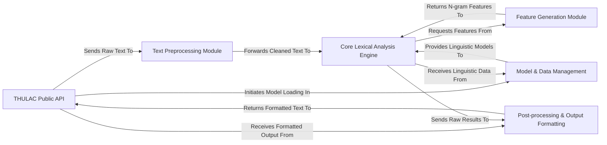

## Details

The THULAC-Python project implements a clear, pipeline-driven architecture for Chinese lexical analysis. At its core, the THULAC Public API serves as the user's gateway, orchestrating the flow of text through a series of specialized modules. Raw input first undergoes normalization and cleaning by the Text Preprocessing Module. The prepared text then enters the Core Lexical Analysis Engine, which performs the fundamental segmentation and part-of-speech tagging. This engine's accuracy is underpinned by linguistic models and data structures managed by the Model & Data Management component, and it dynamically leverages features generated by the Feature Generation Module. Post-analysis, the raw results are refined and formatted by the Post-processing & Output Formatting module before being presented back to the user. This modular design facilitates maintainability, allows for performance optimizations, and provides a clear, sequential data flow, making it ideal for visual representation as a directed graph.

### THULAC Public API [[Expand]](./THULAC_Public_API.md)
The primary user-facing interface and orchestrator of the entire text processing pipeline. It handles input/output, exposes core functionalities, and manages the overall flow.

**Related Classes/Methods**:

- <a href="https://github.com/thunlp/THULAC-Python/blob/master/thulac/__init__.py" target="_blank" rel="noopener noreferrer">`thulac/__init__.py`</a>

### Text Preprocessing Module [[Expand]](./Text_Preprocessing_Module.md)
Responsible for initial cleaning, normalization, and transformation of raw input text, including character encoding handling and traditional-to-simplified Chinese conversion.

**Related Classes/Methods**:

- <a href="https://github.com/thunlp/THULAC-Python/blob/master/thulac/manage/Preprocesser.py" target="_blank" rel="noopener noreferrer">`thulac/manage/Preprocesser.py`</a>
- <a href="https://github.com/thunlp/THULAC-Python/blob/master/thulac/manage/TimeWord.py" target="_blank" rel="noopener noreferrer">`thulac/manage/TimeWord.py`</a>

### Core Lexical Analysis Engine [[Expand]](./Core_Lexical_Analysis_Engine.md)
The central processing unit for character-based segmentation and part-of-speech tagging, applying dynamic programming algorithms and utilizing linguistic models.

**Related Classes/Methods**:

- <a href="https://github.com/thunlp/THULAC-Python/blob/master/thulac/character/CBTaggingDecoder.py" target="_blank" rel="noopener noreferrer">`thulac/character/CBTaggingDecoder.py`</a>
- <a href="https://github.com/thunlp/THULAC-Python/blob/master/thulac/base/AlphaBeta.py" target="_blank" rel="noopener noreferrer">`thulac/base/AlphaBeta.py`</a>

### Feature Generation Module [[Expand]](./Feature_Generation_Module.md)
Generates linguistic features (e.g., N-grams) from input characters, which are crucial inputs for the Core Lexical Analysis Engine's tagging decisions.

**Related Classes/Methods**:

- <a href="https://github.com/thunlp/THULAC-Python/blob/master/thulac/character/CBNGramFeature.py" target="_blank" rel="noopener noreferrer">`thulac/character/CBNGramFeature.py`</a>

### Model & Data Management [[Expand]](./Model_Data_Management.md)
Manages the loading, initialization, and efficient access of pre-trained linguistic models and underlying data structures (e.g., Double Array Tries, character-based models).

**Related Classes/Methods**:

- <a href="https://github.com/thunlp/THULAC-Python/blob/master/thulac/base/Dat.py" target="_blank" rel="noopener noreferrer">`thulac/base/Dat.py`</a>
- <a href="https://github.com/thunlp/THULAC-Python/blob/master/thulac/character/CBModel.py" target="_blank" rel="noopener noreferrer">`thulac/character/CBModel.py`</a>
- <a href="https://github.com/thunlp/THULAC-Python/blob/master/thulac/manage/SoExtention.py" target="_blank" rel="noopener noreferrer">`thulac/manage/SoExtention.py`</a>

### Post-processing & Output Formatting [[Expand]](./Post_processing_Output_Formatting.md)
Refines the raw output from the Core Lexical Analysis Engine, applying post-tagging rules, filtering, and formatting the final results for user consumption.

**Related Classes/Methods**:

- <a href="https://github.com/thunlp/THULAC-Python/blob/master/thulac/manage/Postprocesser.py" target="_blank" rel="noopener noreferrer">`thulac/manage/Postprocesser.py`</a>
- <a href="https://github.com/thunlp/THULAC-Python/blob/master/thulac/manage/Filter.py" target="_blank" rel="noopener noreferrer">`thulac/manage/Filter.py`</a>
- <a href="https://github.com/thunlp/THULAC-Python/blob/master/thulac/manage/Punctuation.py" target="_blank" rel="noopener noreferrer">`thulac/manage/Punctuation.py`</a>

### [FAQ](https://github.com/CodeBoarding/GeneratedOnBoardings/tree/main?tab=readme-ov-file#faq)