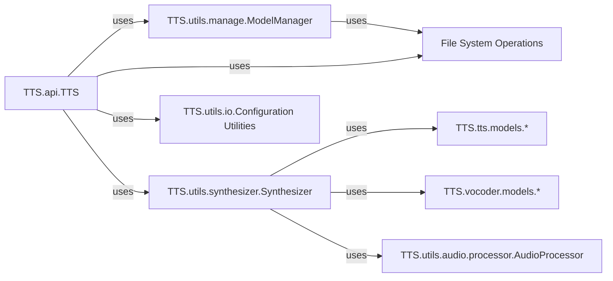

## Component Details

The TTS.api.TTS class serves as the primary public interface and orchestrator for the entire Text-to-Speech (TTS) system. It provides a simplified, high-level API for users to interact with complex functionalities such as loading models, listing available models, performing text-to-speech synthesis, and voice conversion. It abstracts away the intricate details of model management, synthesis pipelines, and audio processing by delegating tasks to specialized internal components.

### TTS.api.TTS
The main entry point for users. It initializes and coordinates other core components to fulfill user requests for TTS and voice conversion. It's fundamental as it's the user-facing facade of the entire system.

**Related Classes/Methods**:

- <a href="https://github.com/coqui-ai/TTS/blob/master/TTS/utils/manage.py#L29-L620" target="_blank" rel="noopener noreferrer">`TTS.utils.manage.ModelManager` (29:620)</a>
- <a href="https://github.com/coqui-ai/TTS/blob/master/TTS/utils/manage.py#L370-L421" target="_blank" rel="noopener noreferrer">`TTS.utils.manage.ModelManager:download_model` (370:421)</a>
- <a href="https://github.com/coqui-ai/TTS/blob/master/TTS/utils/manage.py#L176-L181" target="_blank" rel="noopener noreferrer">`TTS.utils.manage.ModelManager:list_tts_models` (176:181)</a>
- <a href="https://github.com/coqui-ai/TTS/blob/master/TTS/utils/synthesizer.py#L24-L504" target="_blank" rel="noopener noreferrer">`TTS.utils.synthesizer.Synthesizer` (24:504)</a>
- <a href="https://github.com/coqui-ai/TTS/blob/master/TTS/utils/synthesizer.py#L256-L504" target="_blank" rel="noopener noreferrer">`TTS.utils.synthesizer.Synthesizer:tts` (256:504)</a>
- <a href="https://github.com/coqui-ai/TTS/blob/master/TTS/utils/synthesizer.py#L252-L254" target="_blank" rel="noopener noreferrer">`TTS.utils.synthesizer.Synthesizer:voice_conversion` (252:254)</a>
- <a href="https://github.com/coqui-ai/TTS/blob/master/TTS/utils/io.py#L0-L0" target="_blank" rel="noopener noreferrer">`TTS.utils.io:load_config` (0:0)</a>
- `os` (0:0)
- `pathlib` (0:0)
- `tempfile` (0:0)

### TTS.utils.manage.ModelManager
Responsible for discovering, downloading, and managing TTS and voice conversion models. It handles the complexities of fetching models from various sources and preparing them for use. It's fundamental because TTS.api.TTS relies on it to make models available to the system.

**Related Classes/Methods**:

- `os` (0:0)
- `pathlib` (0:0)

### TTS.utils.synthesizer.Synthesizer
The core engine for performing text-to-speech synthesis and voice conversion. It takes processed text and loaded models to generate audio waveforms. It's fundamental as it encapsulates the actual audio generation logic, which is the primary function of the TTS system.

**Related Classes/Methods**:

- `TTS.tts.models` (0:0)
- `TTS.vocoder.models` (0:0)
- <a href="https://github.com/coqui-ai/TTS/blob/master/TTS/utils/audio/processor.py#L31-L632" target="_blank" rel="noopener noreferrer">`TTS.utils.audio.processor.AudioProcessor` (31:632)</a>

### TTS.tts.models.*
This represents the collection of various Text-to-Speech neural network models (e.g., VITS, Tacotron2). These models are responsible for converting textual input into an acoustic representation (like mel-spectrograms). They are fundamental as they contain the learned intelligence for speech generation.

**Related Classes/Methods**: _None_

### TTS.vocoder.models.*
This represents the collection of various vocoder neural network models (e.g., HiFi-GAN). These models convert the acoustic features generated by TTS models into raw, audible audio waveforms. They are fundamental because they are the final step in producing human-perceivable speech.

**Related Classes/Methods**: _None_

### TTS.utils.audio.processor.AudioProcessor
Provides a comprehensive set of functionalities for audio manipulation, including resampling, normalization, and spectrogram generation. It's fundamental because both TTS models and vocoders, as well as the Synthesizer, rely on it for correct audio data handling.

**Related Classes/Methods**: _None_

### TTS.utils.io.Configuration Utilities
A set of utility functions primarily responsible for reading and loading JSON configuration files. These configurations are crucial for initializing and operating TTS and vocoder models correctly. It's fundamental as it enables dynamic model loading and configuration.

**Related Classes/Methods**:

- `json` (0:0)

### File System Operations
Represents the underlying system interactions for reading from and writing to the local file system. This includes operations like creating directories, checking file existence, and saving audio files. It's fundamental for model persistence, loading, and saving synthesized audio.

**Related Classes/Methods**: _None_

### [FAQ](https://github.com/CodeBoarding/GeneratedOnBoardings/tree/main?tab=readme-ov-file#faq)