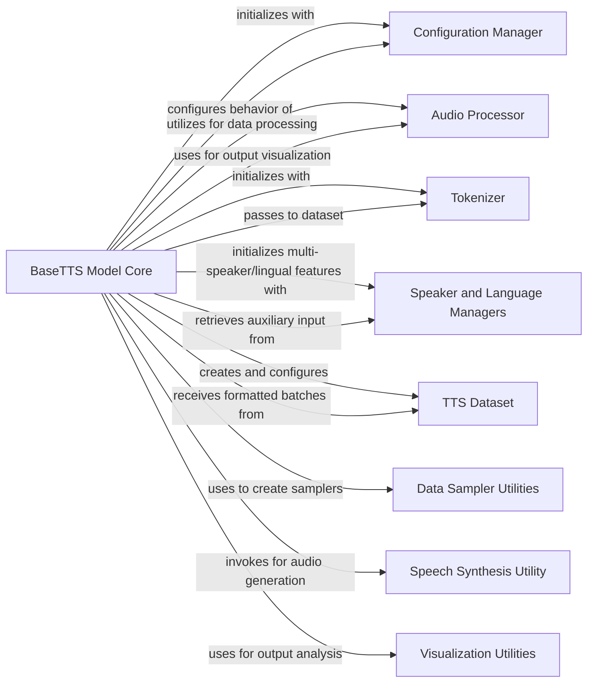

## Component Details

# 📦 Component Overview: `TTS.tts.models.base_tts.BaseTTS`

This document provides a detailed overview of the `BaseTTS` component, an abstract base class fundamental to the Text-to-Speech (TTS) subsystem. It outlines its structure, purpose, and interactions with other key components, highlighting why each is crucial for the overall functionality.

## 1. Central Component: `BaseTTS Model Core`

*   **Component Name:** `BaseTTS Model Core`
*   **Description:** This is the abstract base class (`TTS.tts.models.base_tts.BaseTTS`) for all TTS models within the project. It serves as the foundational blueprint, defining common functionalities and interfaces that concrete TTS model implementations must adhere to. Its core responsibilities include model initialization, argument parsing, multi-speaker and multi-lingual setup, data loader creation, and a standardized test run mechanism. It ensures a consistent API across different TTS architectures, promoting code reusability and simplifying integration with the broader synthesis pipeline.
*   **Source File:** `TTS/tts/models/base_tts.py`
*   **Why Fundamental:** It establishes the contract for all TTS models, ensuring they share a common interface for training, evaluation, and inference. This abstraction is vital for modularity, extensibility, and maintainability of the TTS system.

## 2. Interacting Components and Relationships

Here are the key components interacting with `BaseTTS Model Core`, along with their responsibilities and relationships:

### 2.1. `Configuration Manager`

*   **Component Name:** `Configuration Manager`
*   **Description:** This component, represented by `Coqpit` objects, is responsible for managing and providing all configuration parameters required by the TTS models. This includes model-specific arguments, training parameters, dataset paths, and settings for multi-speaker or multi-lingual capabilities.
*   **Source File:** (Implicitly `coqpit.coqpit` and various config files)
*   **Why Fundamental:** It centralizes and standardizes the configuration process, allowing `BaseTTS` and its concrete implementations to be easily configured without hardcoding parameters.
*   **Relationships:**
    *   (`BaseTTS Model Core`, **initializes with**, `Configuration Manager`): `BaseTTS` receives a `Coqpit` configuration object during its initialization (`__init__`) to set up model arguments and other core properties.
    *   (`BaseTTS Model Core`, **configures behavior of**, `Configuration Manager`): `BaseTTS` methods like `_set_model_args`, `init_multispeaker`, `get_sampler`, and `get_data_loader` extensively use the `Configuration Manager` to adapt their behavior based on the provided settings.

### 2.2. `Audio Processor`

*   **Component Name:** `Audio Processor`
*   **Description:** This component (`ap` instance) handles all audio signal processing tasks. It's responsible for converting raw audio waveforms into features suitable for the TTS model (e.g., spectrograms) and for synthesizing audio from model outputs.
*   **Source File:** (Implicitly `TTS.utils.audio`)
*   **Why Fundamental:** It bridges the gap between raw audio data and the numerical representations required by the neural network, and vice-versa for synthesis.
*   **Relationships:**
    *   (`BaseTTS Model Core`, **utilizes for data processing**, `Audio Processor`): `BaseTTS` uses the `Audio Processor` in its `format_batch` method to process audio data within a batch.
    *   (`BaseTTS Model Core`, **uses for output visualization**, `Audio Processor`): During `test_run`, `BaseTTS` passes the `Audio Processor` to visualization utilities (`plot_spectrogram`) to correctly interpret and display audio features.

### 2.3. `Tokenizer`

*   **Component Name:** `Tokenizer`
*   **Description:** The `Tokenizer` (`TTSTokenizer` instance) is responsible for converting input text into a sequence of numerical tokens (e.g., phonemes or characters) that the TTS model can understand and process.
*   **Source File:** (Implicitly `TTS.tts.utils.text.tokenizer`)
*   **Why Fundamental:** It's the first step in the TTS pipeline, transforming human-readable text into a machine-readable format.
*   **Relationships:**
    *   (`BaseTTS Model Core`, **initializes with**, `Tokenizer`): `BaseTTS` receives a `Tokenizer` instance during its initialization (`__init__`) to handle text input.
    *   (`BaseTTS Model Core`, **passes to dataset**, `Tokenizer`): The `Tokenizer` is passed to the `TTSDataset` within `get_data_loader` to ensure consistent text processing for data loading.

### 2.4. `Speaker and Language Managers`

*   **Component Name:** `Speaker and Language Managers`
*   **Description:** These components (`SpeakerManager`, `LanguageManager`) are responsible for managing speaker and language-specific metadata, including unique IDs, d-vectors (speaker embeddings), and mappings between names and IDs. They enable the TTS system to generate speech for multiple speakers and in various languages.
*   **Source File:** (Implicitly `TTS.tts.utils.managers.speaker_manager`, `TTS.tts.utils.managers.language_manager`)
*   **Why Fundamental:** They provide the necessary context for multi-speaker and multi-lingual TTS, allowing the model to adapt its output based on the desired speaker or language.
*   **Relationships:**
    *   (`BaseTTS Model Core`, **initializes multi-speaker/lingual features with**, `Speaker and Language Managers`): `BaseTTS` uses these managers in `init_multispeaker` to set up speaker embedding layers and in `get_data_loader` to pass speaker/language mappings to the dataset.
    *   (`BaseTTS Model Core`, **retrieves auxiliary input from**, `Speaker and Language Managers`): Methods like `get_aux_input_from_test_sentences` and `_get_test_aux_input` query these managers to obtain speaker IDs, d-vectors, or language IDs for inference.

### 2.5. `TTS Dataset`

*   **Component Name:** `TTS Dataset`
*   **Description:** This component (`TTS.tts.datasets.dataset.TTSDataset`) is responsible for loading, preprocessing, and preparing the raw audio and text data into a format suitable for consumption by the TTS models during training and evaluation. It handles tasks like batching, padding, and feature extraction.
*   **Source File:** `TTS/tts/datasets/dataset.py`
*   **Why Fundamental:** It's the primary source of data for the TTS model, ensuring that data is efficiently loaded and presented in the correct format.
*   **Relationships:**
    *   (`BaseTTS Model Core`, **creates and configures**, `TTS Dataset`): The `get_data_loader` method in `BaseTTS` instantiates and configures the `TTSDataset` with various parameters from the configuration.
    *   (`BaseTTS Model Core`, **receives formatted batches from**, `TTS Dataset`): The `format_batch` method in `BaseTTS` expects input in the format provided by `TTSDataset`.

### 2.6. `Data Sampler Utilities`

*   **Component Name:** `Data Sampler Utilities`
*   **Description:** This component comprises utility functions (`get_language_balancer_weights`, `get_speaker_balancer_weights`, `get_length_balancer_weights`) that calculate weights for balancing data based on different criteria (languages, speakers, data length). These weights are then used by a `WeightedRandomSampler` to ensure diverse and representative batches during training, especially in multi-speaker or multi-lingual scenarios.
*   **Source File:** `TTS/tts/utils/languages.py`, `TTS/tts/utils/speakers.py`, `TTS/tts/utils/data.py`
*   **Why Fundamental:** They address data imbalance issues, which are common in real-world TTS datasets, leading to more robust and generalized models.
*   **Relationships:**
    *   (`BaseTTS Model Core`, **uses to create samplers**, `Data Sampler Utilities`): The `get_sampler` method within `BaseTTS` directly calls these utilities to compute weights for the data sampler.

### 2.7. `Speech Synthesis Utility`

*   **Component Name:** `Speech Synthesis Utility`
*   **Description:** This utility function (`TTS.tts.utils.synthesis.synthesis`) encapsulates the core logic for performing speech synthesis. Given a trained TTS model and input text, it orchestrates the process of generating an audio waveform.
*   **Source File:** `TTS/tts/utils/synthesis.py`
*   **Why Fundamental:** It's the direct interface for generating audio from the trained TTS model, crucial for inference and testing.
*   **Relationships:**
    *   (`BaseTTS Model Core`, **invokes for audio generation**, `Speech Synthesis Utility`): The `test_run` method in `BaseTTS` calls the `synthesis` function to generate audio for test sentences.

### 2.8. `Visualization Utilities`

*   **Component Name:** `Visualization Utilities`
*   **Description:** This component (`TTS.tts.utils.visual`) provides functions for visualizing key outputs of the TTS model, such as spectrograms and attention alignments. These visualizations are invaluable for debugging, analyzing model performance, and understanding the internal workings of the model during development and research.
*   **Source File:** `TTS/tts/utils/visual.py`
*   **Why Fundamental:** They offer critical insights into the model's behavior, helping developers identify issues, track progress, and interpret results.
*   **Relationships:**
    *   (`BaseTTS Model Core`, **uses for output analysis**, `Visualization Utilities`): The `test_run` method in `BaseTTS` calls `plot_spectrogram` and `plot_alignment` to generate visual representations of the model's predictions.

### BaseTTS Model Core
This is the abstract base class (`TTS.tts.models.base_tts.BaseTTS`) for all TTS models within the project. It serves as the foundational blueprint, defining common functionalities and interfaces that concrete TTS model implementations must adhere to. Its core responsibilities include model initialization, argument parsing, multi-speaker and multi-lingual setup, data loader creation, and a standardized test run mechanism. It ensures a consistent API across different TTS architectures, promoting code reusability and simplifying integration with the broader synthesis pipeline.

**Related Classes/Methods**:

- <a href="https://github.com/coqui-ai/TTS/blob/master/TTS/tts/models/base_tts.py#L23-L440" target="_blank" rel="noopener noreferrer">`TTS.tts.models.base_tts.BaseTTS` (23:440)</a>

### Configuration Manager
This component, represented by `Coqpit` objects, is responsible for managing and providing all configuration parameters required by the TTS models. This includes model-specific arguments, training parameters, dataset paths, and settings for multi-speaker or multi-lingual capabilities.

**Related Classes/Methods**:

- `coqpit.coqpit` (0:0)

### Audio Processor
This component (`ap` instance) handles all audio signal processing tasks. It's responsible for converting raw audio waveforms into features suitable for the TTS model (e.g., spectrograms) and for synthesizing audio from model outputs.

**Related Classes/Methods**:

- `TTS.utils.audio` (0:0)

### Tokenizer
The `Tokenizer` (`TTSTokenizer` instance) is responsible for converting input text into a sequence of numerical tokens (e.g., phonemes or characters) that the TTS model can understand and process.

**Related Classes/Methods**:

- <a href="https://github.com/coqui-ai/TTS/blob/master/TTS/tts/utils/text/tokenizer.py#L9-L215" target="_blank" rel="noopener noreferrer">`TTS.tts.utils.text.tokenizer.TTSTokenizer` (9:215)</a>

### Speaker and Language Managers
These components (`SpeakerManager`, `LanguageManager`) are responsible for managing speaker and language-specific metadata, including unique IDs, d-vectors (speaker embeddings), and mappings between names and IDs. They enable the TTS system to generate speech for multiple speakers and in various languages.

**Related Classes/Methods**:

- <a href="https://github.com/coqui-ai/TTS/blob/master/TTS/tts/utils/managers.py#L0-L0" target="_blank" rel="noopener noreferrer">`TTS.tts.utils.managers.speaker_manager.SpeakerManager` (0:0)</a>
- <a href="https://github.com/coqui-ai/TTS/blob/master/TTS/tts/utils/managers.py#L0-L0" target="_blank" rel="noopener noreferrer">`TTS.tts.utils.managers.language_manager.LanguageManager` (0:0)</a>

### TTS Dataset
This component (`TTS.tts.datasets.dataset.TTSDataset`) is responsible for loading, preprocessing, and preparing the raw audio and text data into a format suitable for consumption by the TTS models during training and evaluation. It handles tasks like batching, padding, and feature extraction.

**Related Classes/Methods**:

- <a href="https://github.com/coqui-ai/TTS/blob/master/TTS/tts/datasets/dataset.py#L55-L573" target="_blank" rel="noopener noreferrer">`TTS.tts.datasets.dataset.TTSDataset` (55:573)</a>

### Data Sampler Utilities
This component comprises utility functions (`get_language_balancer_weights`, `get_speaker_balancer_weights`, `get_length_balancer_weights`) that calculate weights for balancing data based on different criteria (languages, speakers, data length). These weights are then used by a `WeightedRandomSampler` to ensure diverse and representative batches during training, especially in multi-speaker or multi-lingual scenarios.

**Related Classes/Methods**:

- <a href="https://github.com/coqui-ai/TTS/blob/master/TTS/tts/utils/languages.py#L114-L124" target="_blank" rel="noopener noreferrer">`TTS.tts.utils.languages.get_language_balancer_weights` (114:124)</a>
- <a href="https://github.com/coqui-ai/TTS/blob/master/TTS/tts/utils/speakers.py#L212-L221" target="_blank" rel="noopener noreferrer">`TTS.tts.utils.speakers.get_speaker_balancer_weights` (212:221)</a>
- <a href="https://github.com/coqui-ai/TTS/blob/master/TTS/tts/utils/data.py#L58-L78" target="_blank" rel="noopener noreferrer">`TTS.tts.utils.data.get_length_balancer_weights` (58:78)</a>

### Speech Synthesis Utility
This utility function (`TTS.tts.utils.synthesis.synthesis`) encapsulates the core logic for performing speech synthesis. Given a trained TTS model and input text, it orchestrates the process of generating an audio waveform.

**Related Classes/Methods**:

- <a href="https://github.com/coqui-ai/TTS/blob/master/TTS/tts/utils/synthesis.py#L115-L251" target="_blank" rel="noopener noreferrer">`TTS.tts.utils.synthesis.synthesis` (115:251)</a>

### Visualization Utilities
This component (`TTS.tts.utils.visual`) provides functions for visualizing key outputs of the TTS model, such as spectrograms and attention alignments. These visualizations are invaluable for debugging, analyzing model performance, and understanding the internal workings of the model during development and research.

**Related Classes/Methods**:

- <a href="https://github.com/coqui-ai/TTS/blob/master/TTS/tts/utils/visual.py#L35-L49" target="_blank" rel="noopener noreferrer">`TTS.tts.utils.visual.plot_spectrogram` (35:49)</a>
- <a href="https://github.com/coqui-ai/TTS/blob/master/TTS/tts/utils/visual.py#L10-L32" target="_blank" rel="noopener noreferrer">`TTS.tts.utils.visual.plot_alignment` (10:32)</a>

### [FAQ](https://github.com/CodeBoarding/GeneratedOnBoardings/tree/main?tab=readme-ov-file#faq)