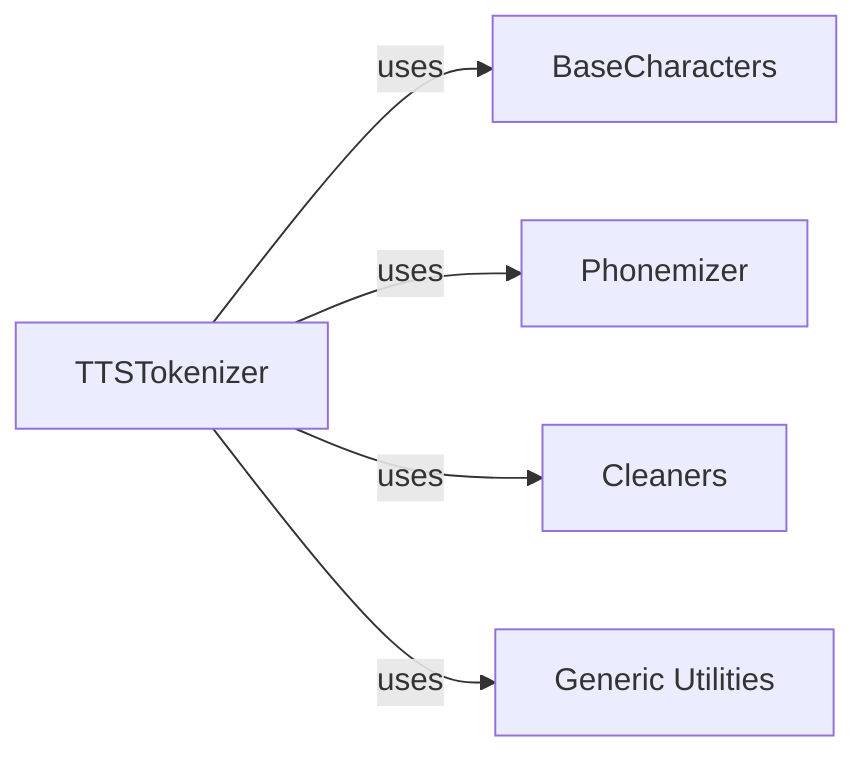

## Component Details

The `TTSTokenizer` is the core component of the text processing subsystem, responsible for converting raw text into a sequence of numerical IDs (tokens) for TTS models. It orchestrates the use of other components to achieve this.

### TTSTokenizer
The central component that manages the entire text-to-token conversion pipeline. It handles text cleaning, optional phonemization, and the addition of special tokens (BOS, EOS, blank). It serves as the primary interface for preparing text input for TTS models.

**Related Classes/Methods**:

- <a href="https://github.com/coqui-ai/TTS/blob/master/TTS/tts/utils/text/tokenizer.py#L9-L215" target="_blank" rel="noopener noreferrer">`TTS.tts.utils.text.tokenizer.TTSTokenizer` (9:215)</a>

### BaseCharacters
Defines the character set or phoneme set used for tokenization. `BaseCharacters` is an abstract base class providing the interface for mapping characters/phonemes to their unique IDs and vice-versa, as well as defining special token IDs (BOS, EOS, blank, pad). `Graphemes` handles standard written characters, while `IPAPhonemes` manages International Phonetic Alphabet characters.

**Related Classes/Methods**:

- <a href="https://github.com/coqui-ai/TTS/blob/master/TTS/tts/utils/text/characters.py#L137-L344" target="_blank" rel="noopener noreferrer">`TTS.tts.utils.text.characters.BaseCharacters` (137:344)</a>
- <a href="https://github.com/coqui-ai/TTS/blob/master/TTS/tts/utils/text/characters.py#L425-L493" target="_blank" rel="noopener noreferrer">`TTS.tts.utils.text.characters.Graphemes` (425:493)</a>
- <a href="https://github.com/coqui-ai/TTS/blob/master/TTS/tts/utils/text/characters.py#L347-L422" target="_blank" rel="noopener noreferrer">`TTS.tts.utils.text.characters.IPAPhonemes` (347:422)</a>

### Phonemizer
An abstract base class for converting text into phonemes. Concrete implementations like `ESpeak` and `MultiPhonemizer` provide the actual phonemization logic. This step is crucial for models that operate on phonemic representations for more natural and accurate speech synthesis.

**Related Classes/Methods**:

- <a href="https://github.com/coqui-ai/TTS/blob/master/TTS/tts/utils/text/phonemizers/base.py#L0-L0" target="_blank" rel="noopener noreferrer">`TTS.tts.utils.text.phonemizers.base.Phonemizer` (0:0)</a>
- <a href="https://github.com/coqui-ai/TTS/blob/master/TTS/tts/utils/text/phonemizers/espeak_wrapper.py#L82-L248" target="_blank" rel="noopener noreferrer">`TTS.tts.utils.text.phonemizers.espeak_wrapper.ESpeak` (82:248)</a>
- <a href="https://github.com/coqui-ai/TTS/blob/master/TTS/tts/utils/text/phonemizers/multi_phonemizer.py#L5-L49" target="_blank" rel="noopener noreferrer">`TTS.tts.utils.text.phonemizers.multi_phonemizer.MultiPhonemizer` (5:49)</a>

### Cleaners
A module containing various functions for text preprocessing and normalization. This includes tasks like expanding abbreviations, normalizing numbers and times, and handling punctuation, ensuring that the input text is consistent and clean before tokenization or phonemization.

**Related Classes/Methods**:

- <a href="https://github.com/coqui-ai/TTS/blob/master/TTS/tts/utils/text/cleaners.py#L0-L0" target="_blank" rel="noopener noreferrer">`TTS.tts.utils.text.cleaners` (0:0)</a>

### Generic Utilities
A utility module providing helper functions for dynamically importing classes and retrieving their import paths. This allows the `TTSTokenizer` to load different character sets or phonemizers at runtime based on configuration, promoting flexibility and extensibility.

**Related Classes/Methods**:

- <a href="https://github.com/coqui-ai/TTS/blob/master/TTS/utils/generic_utils.py#L99-L111" target="_blank" rel="noopener noreferrer">`TTS.utils.generic_utils.import_class` (99:111)</a>
- <a href="https://github.com/coqui-ai/TTS/blob/master/TTS/utils/generic_utils.py#L114-L123" target="_blank" rel="noopener noreferrer">`TTS.utils.generic_utils.get_import_path` (114:123)</a>

### [FAQ](https://github.com/CodeBoarding/GeneratedOnBoardings/tree/main?tab=readme-ov-file#faq)