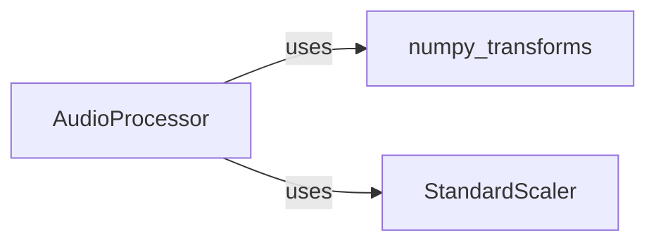

## Component Details

This analysis details the core components of the `TTS` project's audio subsystem, centered around `TTS.utils.audio.processor.AudioProcessor`. It describes `AudioProcessor` as the central orchestrator, `numpy_transforms` as the provider of low-level numerical transformations, and `StandardScaler` for feature normalization. The relationships highlight how `AudioProcessor` leverages the functionalities of `numpy_transforms` and `StandardScaler` to ensure consistent and effective audio processing for machine learning models.

### AudioProcessor
The central orchestrator for audio processing within the `TTS` project. It provides a comprehensive set of functionalities for audio manipulation, including loading WAV files, computing spectrograms and mel-spectrograms, applying pre-emphasis, normalization, and saving processed audio. It acts as a high-level interface for other modules to interact with audio data, ensuring consistent audio feature extraction and processing for both training and inference.

**Related Classes/Methods**:

- <a href="https://github.com/coqui-ai/TTS/blob/master/TTS/utils/audio/processor.py#L31-L632" target="_blank" rel="noopener noreferrer">`TTS.utils.audio.processor.AudioProcessor` (31:632)</a>

### numpy_transforms
This module encapsulates a collection of low-level, numerical (NumPy-based) audio transformation functions. These functions are the fundamental building blocks that `AudioProcessor` utilizes to perform its core tasks, such as Short-Time Fourier Transform (STFT), mel-spectrogram conversion, amplitude to decibel conversion, Griffin-Lim algorithm, silence trimming, volume normalization, and pre/de-emphasis.

**Related Classes/Methods**:

- <a href="https://github.com/coqui-ai/TTS/blob/master/TTS/utils/audio/numpy_transforms.py#L0-L1" target="_blank" rel="noopener noreferrer">`TTS.utils.audio.numpy_transforms` (0:1)</a>

### StandardScaler
A utility class designed for standardizing features by removing the mean and scaling to unit variance. In the context of `AudioProcessor`, it is specifically used to normalize and denormalize audio features, such as spectrograms, ensuring that data is consistently scaled for downstream machine learning models.

**Related Classes/Methods**:

- <a href="https://github.com/coqui-ai/TTS/blob/master/TTS/tts/utils/helpers.py#L13-L38" target="_blank" rel="noopener noreferrer">`TTS.tts.utils.helpers.StandardScaler` (13:38)</a>

### [FAQ](https://github.com/CodeBoarding/GeneratedOnBoardings/tree/main?tab=readme-ov-file#faq)