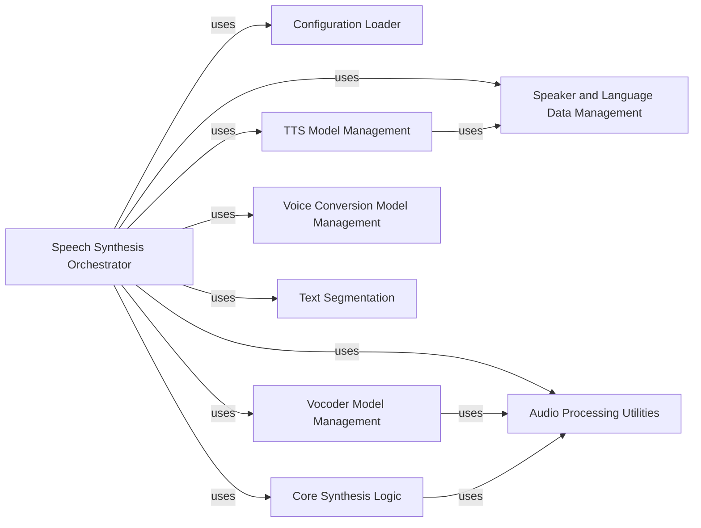

## Component Details

This analysis focuses on the `Synthesizer` component, which acts as the central orchestrator for speech synthesis and voice conversion within the `TTS` project. It integrates various sub-components to manage the entire pipeline from text input to audio output.

### Speech Synthesis Orchestrator
The `Synthesizer` class is the core component, responsible for initializing, configuring, and coordinating all other models and utilities required for speech synthesis and voice conversion. It manages the flow of data, from text processing to final audio generation and saving.

**Related Classes/Methods**:

- <a href="https://github.com/coqui-ai/TTS/blob/master/TTS/utils/synthesizer.py#L24-L504" target="_blank" rel="noopener noreferrer">`TTS.utils.synthesizer.Synthesizer` (24:504)</a>

### Configuration Loader
This component, primarily represented by `load_config`, handles the parsing and loading of JSON configuration files. These configurations are vital for setting up and parameterizing the TTS, vocoder, and voice conversion models.

**Related Classes/Methods**:

- <a href="https://github.com/coqui-ai/TTS/blob/master/TTS/utils/io.py#L0-L0" target="_blank" rel="noopener noreferrer">`TTS.utils.io.load_config` (0:0)</a>

### TTS Model Management
This component encompasses the logic for setting up and loading various Text-to-Speech models (e.g., `Vits`, `setup_tts_model`). It handles checkpoint loading and ensures the TTS model is ready for inference.

**Related Classes/Methods**:

- <a href="https://github.com/coqui-ai/TTS/blob/master/TTS/tts/models/vits.py#L602-L1925" target="_blank" rel="noopener noreferrer">`TTS.tts.models.Vits` (602:1925)</a>
- `TTS.tts.models.setup_tts_model` (0:0)

### Vocoder Model Management
Responsible for initializing and managing vocoder models (`setup_vocoder_model`). Its main function is to convert the mel-spectrograms generated by the TTS model into audible waveforms.

**Related Classes/Methods**:

- `TTS.vocoder.models.setup_vocoder_model` (0:0)

### Voice Conversion Model Management
This component (`setup_vc_model`) handles the setup and execution of dedicated voice conversion models, allowing the `Synthesizer` to alter the voice characteristics of an input audio.

**Related Classes/Methods**:

- `TTS.vocoder.models.setup_vc_model` (0:0)

### Speaker and Language Data Management
This component (involving `TTS.tts.utils.speakers`, `TTS.tts.utils.languages`, and `TTS.tts.utils.managers`) manages speaker and language IDs, mappings, and the computation of speaker embeddings from audio clips. This is essential for multi-speaker, multi-lingual, and voice cloning functionalities.

**Related Classes/Methods**:

- <a href="https://github.com/coqui-ai/TTS/blob/master/TTS/tts/utils/speakers.py#L0-L0" target="_blank" rel="noopener noreferrer">`TTS.tts.utils.speakers` (0:0)</a>
- <a href="https://github.com/coqui-ai/TTS/blob/master/TTS/tts/utils/languages.py#L0-L0" target="_blank" rel="noopener noreferrer">`TTS.tts.utils.languages` (0:0)</a>
- <a href="https://github.com/coqui-ai/TTS/blob/master/TTS/tts/utils/managers.py#L0-L0" target="_blank" rel="noopener noreferrer">`TTS.tts.utils.managers` (0:0)</a>

### Audio Processing Utilities
A collection of functions and classes (`TTS.utils.audio`, `TTS.utils.audio.processor`, `TTS.utils.audio.numpy_transforms`) for various audio manipulations, including normalization, denormalization, saving waveforms, and trimming silence.

**Related Classes/Methods**:

- `TTS.utils.audio` (0:0)
- <a href="https://github.com/coqui-ai/TTS/blob/master/TTS/utils/audio/processor.py#L0-L0" target="_blank" rel="noopener noreferrer">`TTS.utils.audio.processor` (0:0)</a>
- <a href="https://github.com/coqui-ai/TTS/blob/master/TTS/utils/audio/numpy_transforms.py#L0-L0" target="_blank" rel="noopener noreferrer">`TTS.utils.audio.numpy_transforms` (0:0)</a>

### Text Segmentation
The `_get_segmenter` method, leveraging `pysbd`, is responsible for accurately splitting raw input text into individual sentences. This is a crucial preprocessing step as TTS models often process text sentence by sentence.

**Related Classes/Methods**:

- <a href="https://github.com/coqui-ai/TTS/blob/master/TTS/utils/synthesizer.py#L112-L121" target="_blank" rel="noopener noreferrer">`TTS.utils.synthesizer.Synthesizer:_get_segmenter` (112:121)</a>

### Core Synthesis Logic
This component, represented by `synthesis` and `transfer_voice` functions, contains the direct implementation of the speech generation and voice transfer algorithms. It interacts with the loaded TTS and vocoder models to produce the final audio.

**Related Classes/Methods**:

- <a href="https://github.com/coqui-ai/TTS/blob/master/TTS/tts/utils/synthesis.py#L115-L251" target="_blank" rel="noopener noreferrer">`TTS.tts.utils.synthesis.synthesis` (115:251)</a>
- <a href="https://github.com/coqui-ai/TTS/blob/master/TTS/tts/utils/synthesis.py#L254-L342" target="_blank" rel="noopener noreferrer">`TTS.tts.utils.synthesis.transfer_voice` (254:342)</a>

### [FAQ](https://github.com/CodeBoarding/GeneratedOnBoardings/tree/main?tab=readme-ov-file#faq)