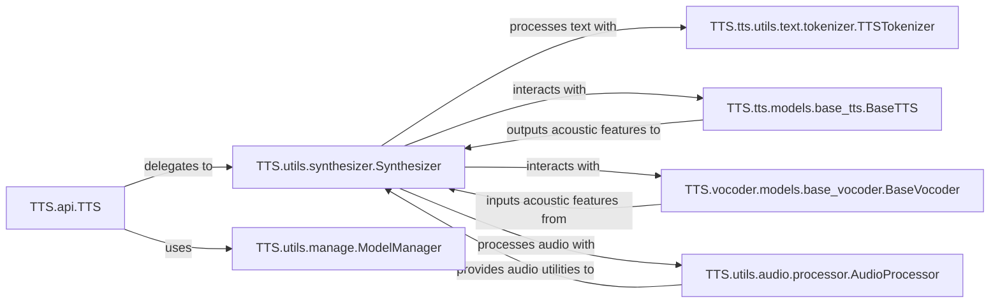

## Component Details

This analysis provides a clear and concise overview of how text is transformed into speech within the `TTS` project, highlighting the key modules responsible for each stage of the data flow. It focuses on the inference (text-to-speech) pipeline and essential supporting functionalities, omitting components related to training, specific model implementations, or more specialized features to maintain a high-level, core-functionality perspective of the `TTS` project's final architecture.

### TTS.api.TTS
The primary public interface for interacting with the TTS system. It provides high-level methods for loading models, listing available models, performing text-to-speech synthesis, and voice conversion. It acts as an orchestrator, delegating core tasks to lower-level components.

**Related Classes/Methods**:

- <a href="https://github.com/coqui-ai/TTS/blob/master/TTS/api.py#L14-L457" target="_blank" rel="noopener noreferrer">`TTS.api.TTS` (14:457)</a>

### TTS.utils.synthesizer.Synthesizer
The central orchestrator for speech synthesis and voice conversion. It loads and manages the TTS model, vocoder, and optionally voice conversion models and speaker encoders. It handles the sequence of operations from text processing to audio generation and saving.

**Related Classes/Methods**:

- <a href="https://github.com/coqui-ai/TTS/blob/master/TTS/utils/synthesizer.py#L24-L504" target="_blank" rel="noopener noreferrer">`TTS.utils.synthesizer.Synthesizer` (24:504)</a>

### TTS.utils.manage.ModelManager
Responsible for managing TTS and Vocoder models, including listing available models, downloading pre-trained models from various sources (GitHub, HuggingFace), and handling model file paths. It ensures that the correct model checkpoints and configurations are retrieved for use.

**Related Classes/Methods**:

- <a href="https://github.com/coqui-ai/TTS/blob/master/TTS/utils/manage.py#L29-L620" target="_blank" rel="noopener noreferrer">`TTS.utils.manage.ModelManager` (29:620)</a>

### TTS.utils.audio.processor.AudioProcessor
Provides a comprehensive set of functionalities for audio manipulation, including loading WAV files, computing spectrograms and mel-spectrograms, applying pre-emphasis, normalization, and saving processed audio. It's fundamental for both training and inference, ensuring consistent audio feature extraction and processing.

**Related Classes/Methods**:

- <a href="https://github.com/coqui-ai/TTS/blob/master/TTS/utils/audio/processor.py#L31-L632" target="_blank" rel="noopener noreferrer">`TTS.utils.audio.processor.AudioProcessor` (31:632)</a>

### TTS.tts.utils.text.tokenizer.TTSTokenizer
Handles the conversion of raw text into a sequence of IDs (tokens) that can be processed by TTS models. It supports various text cleaning, normalization, and phonemization processes based on language and configuration, preparing the text input for the neural network.

**Related Classes/Methods**:

- <a href="https://github.com/coqui-ai/TTS/blob/master/TTS/tts/utils/text/tokenizer.py#L9-L215" target="_blank" rel="noopener noreferrer">`TTS.tts.utils.text.tokenizer.TTSTokenizer` (9:215)</a>

### TTS.tts.models.base_tts.BaseTTS
An abstract base class for all Text-to-Speech models in the project. It defines common functionalities and interfaces that concrete TTS model implementations must adhere to. This promotes code reusability, a consistent API for different TTS architectures, and simplifies integration with the `Synthesizer`.

**Related Classes/Methods**:

- <a href="https://github.com/coqui-ai/TTS/blob/master/TTS/tts/models/base_tts.py#L23-L440" target="_blank" rel="noopener noreferrer">`TTS.tts.models.base_tts.BaseTTS` (23:440)</a>

### TTS.vocoder.models.base_vocoder.BaseVocoder
An abstract base class for all Vocoder models. It provides a common interface for waveform generation from acoustic features (like mel-spectrograms). Vocoders are crucial for converting the output of acoustic models into audible speech.

**Related Classes/Methods**:

- <a href="https://github.com/coqui-ai/TTS/blob/master/TTS/vocoder/models/base_vocoder.py#L7-L54" target="_blank" rel="noopener noreferrer">`TTS.vocoder.models.base_vocoder.BaseVocoder` (7:54)</a>

### [FAQ](https://github.com/CodeBoarding/GeneratedOnBoardings/tree/main?tab=readme-ov-file#faq)