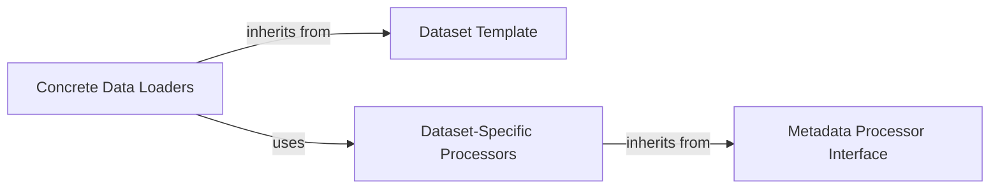

## Details

This analysis focuses on the data processing and loading pipeline within the TensorFlowTTS framework, specifically how raw data from different speech corpora is transformed into a format suitable for training text-to-speech models.

### Dataset Template
An abstract base class (`AbstractDataset`) that defines a standardized, reusable data loading and processing pipeline using the Template Method design pattern. It orchestrates common `tf.data` operations like shuffling, batching, and prefetching, while delegating dataset-specific parsing logic to its subclasses.

**Related Classes/Methods**:

- `tensorflow_tts.dataset.abstract_dataset.AbstractDataset`

### Concrete Data Loaders
A set of concrete classes (`MelDataset`, `AudioDataset`) that implement the `Dataset Template`. Each class is responsible for loading a specific data format, such as pre-computed mel-spectrograms or raw audio files, from the filesystem. They provide the core data-reading logic that the template orchestrates.

**Related Classes/Methods**:

- `tensorflow_tts.dataset.mel_dataset.MelDataset`
- `tensorflow_tts.dataset.audio_dataset.AudioDataset`

### Metadata Processor Interface
An abstract base class (`BaseProcessor`) that defines the interface for parsing dataset-specific metadata. It decouples the data loaders from the varied file formats and directory structures of different speech corpora, ensuring that any dataset can be adapted to the pipeline by implementing this interface.

**Related Classes/Methods**:

- <a href="https://github.com/TensorSpeech/TensorFlowTTS/blob/master/tensorflow_tts/processor/base_processor.py#L29-L230" target="_blank" rel="noopener noreferrer">`tensorflow_tts.processor.base_processor.BaseProcessor` (29:230)</a>

### Dataset-Specific Processors
Concrete implementations of the `Metadata Processor Interface`. Each processor class is tailored to a specific speech corpus (e.g., LJSpeech, KSS). It is responsible for parsing the dataset's metadata files (e.g., `metadata.csv`) to generate a clean list of training items, typically mapping audio file paths to their corresponding text transcriptions.

**Related Classes/Methods**:

- <a href="https://github.com/TensorSpeech/TensorFlowTTS/blob/master/tensorflow_tts/processor/ljspeech.py#L132-L221" target="_blank" rel="noopener noreferrer">`tensorflow_tts.processor.ljspeech.LJSpeechProcessor` (132:221)</a>
- <a href="https://github.com/TensorSpeech/TensorFlowTTS/blob/master/tensorflow_tts/processor/kss.py#L32-L121" target="_blank" rel="noopener noreferrer">`tensorflow_tts.processor.kss.KSSProcessor` (32:121)</a>

### [FAQ](https://github.com/CodeBoarding/GeneratedOnBoardings/tree/main?tab=readme-ov-file#faq)