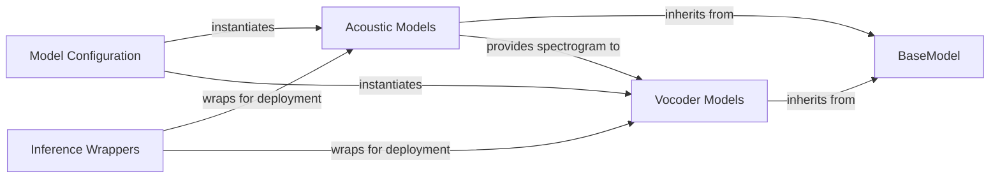

## Details

An analysis of the Model Architectures subsystem, revealing a modular and extensible design centered around a core base class and a clear separation between acoustic and vocoder models.

### BaseModel
An abstract base class that defines the common interface for all TTS models. It establishes the contract for the forward pass, loss calculation, and inference, enabling any model to be seamlessly integrated with the `Trainer Engine`.

**Related Classes/Methods**:

- `tensorflow_tts.models.base_model`

### Model Configuration
A set of data classes used to define the hyperparameters and architecture of each model. These configuration objects are used to instantiate models, promoting a clean separation of configuration from code.

**Related Classes/Methods**:

- `tensorflow_tts.configs`

### Acoustic Models
A category of models responsible for the first stage of synthesis: converting processed text inputs into a mel-spectrogram representation.

**Related Classes/Methods**:

- `fastspeech2`
- `tacotron2`
- `fastspeech`

### Vocoder Models
A category of models that perform the second stage of synthesis: converting mel-spectrograms into an audible waveform. These often use GANs, comprising both a generator and a discriminator.

**Related Classes/Methods**:

- `melgan`
- `mb_melgan`
- `hifigan`

### Inference Wrappers
Specialized, serializable `tf.Module` classes that wrap trained models to provide a simplified, consistent inference interface (`tf.function` decorated `__call__`).

**Related Classes/Methods**:

- `SavableTFFastSpeech`

### [FAQ](https://github.com/CodeBoarding/GeneratedOnBoardings/tree/main?tab=readme-ov-file#faq)