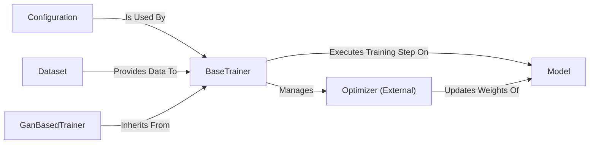

## Details

An analysis of the original feedback reveals several valid points that require architectural correction. The initial component definition was flawed, leading to a nonsensical relationship map. Specifically, the `Training Orchestration Engine` and `BaseTrainer` were redundant as they both referred to the `base_trainer` class. The `Configuration` component incorrectly pointed to a static YAML file instead of the class responsible for parsing it, and the `Optimizer` was not correctly identified as an external dependency.

The following revised analysis integrates this feedback, resulting in a more accurate and logical architectural overview.

### BaseTrainer
The central component that orchestrates the training lifecycle and defines the abstract training algorithm. It manages the training loop, data iteration, model evaluation, and checkpointing. Subclasses implement the concrete training step logic (e.g., for GANs or Seq2Seq models).

**Related Classes/Methods**:

- <a href="https://github.com/TensorSpeech/TensorFlowTTS/blob/master/tensorflow_tts/trainers/base_trainer.py#L1-L1" target="_blank" rel="noopener noreferrer">`tensorflow_tts.trainers.base_trainer.BaseTrainer` (1:1)</a>

### GanBasedTrainer
A concrete implementation of `BaseTrainer` tailored for Generative Adversarial Networks (GANs). It overrides the standard training step to handle the distinct logic of updating a generator and a discriminator with their respective optimizers and loss functions.

**Related Classes/Methods**:

- <a href="https://github.com/TensorSpeech/TensorFlowTTS/blob/master/tensorflow_tts/trainers/base_trainer.py#L186-L678" target="_blank" rel="noopener noreferrer">`tensorflow_tts.trainers.base_trainer.GanBasedTrainer` (186:678)</a>

### Model
The neural network architecture to be trained, inheriting from a common base class. It is responsible for the forward pass (making predictions) and loss calculation. The trainer interacts with it through a standardized interface.

**Related Classes/Methods**:

- <a href="https://github.com/TensorSpeech/TensorFlowTTS/blob/master/tensorflow_tts/models/base_model.py#L24-L32" target="_blank" rel="noopener noreferrer">`tensorflow_tts.models.base_model.BaseModel` (24:32)</a>

### Dataset
Responsible for loading and preprocessing data into `tf.data.Dataset` objects. It provides the training and validation data iterators that the `BaseTrainer` consumes during the `fit` cycle, based on a common abstract interface.

**Related Classes/Methods**:

- <a href="https://github.com/TensorSpeech/TensorFlowTTS/blob/master/tensorflow_tts/datasets/abstract_dataset.py#L21-L76" target="_blank" rel="noopener noreferrer">`tensorflow_tts.datasets.abstract_dataset.AbstractDataset` (21:76)</a>

### Configuration
A component responsible for loading, parsing, and providing all hyperparameters and settings from configuration files. It uses a base class to ensure a consistent configuration structure for all models and trainers.

**Related Classes/Methods**:

- <a href="https://github.com/TensorSpeech/TensorFlowTTS/blob/master/tensorflow_tts/configs/base_config.py#L23-L31" target="_blank" rel="noopener noreferrer">`tensorflow_tts.configs.base_config.BaseConfig` (23:31)</a>

### Optimizer (External)
An external dependency from the TensorFlow framework that manages the application of gradients to the model's trainable parameters. The `BaseTrainer` instantiates and controls one or more optimizers based on the `Configuration`.

**Related Classes/Methods**:

- `tensorflow.keras.optimizers.Optimizer` (1:1)

### [FAQ](https://github.com/CodeBoarding/GeneratedOnBoardings/tree/main?tab=readme-ov-file#faq)