```mermaid
graph LR
    Data_Processing_Pipeline["Data Processing Pipeline"]
    Data_Loading_Engine["Data Loading Engine"]
    Model_Architectures["Model Architectures"]
    Configuration_Management["Configuration Management"]
    Training_Orchestration_Engine["Training Orchestration Engine"]
    Inference_Serving_Facade["Inference & Serving Facade"]
    Data_Processing_Pipeline -- "Produces standardized data for" --> Data_Loading_Engine
    Data_Loading_Engine -- "Feeds training data to" --> Training_Orchestration_Engine
    Configuration_Management -- "Configures" --> Training_Orchestration_Engine
    Training_Orchestration_Engine -- "Instantiates and trains" --> Model_Architectures
    Inference_Serving_Facade -- "Loads pre-trained" --> Model_Architectures
    Inference_Serving_Facade -- "Uses text processing logic from" --> Data_Processing_Pipeline
    click Data_Processing_Pipeline href "https://github.com/CodeBoarding/GeneratedOnBoardings/blob/main/TensorFlowTTS/Data_Processing_Pipeline.md" "Details"
    click Data_Loading_Engine href "https://github.com/CodeBoarding/GeneratedOnBoardings/blob/main/TensorFlowTTS/Data_Loading_Engine.md" "Details"
    click Model_Architectures href "https://github.com/CodeBoarding/GeneratedOnBoardings/blob/main/TensorFlowTTS/Model_Architectures.md" "Details"
    click Training_Orchestration_Engine href "https://github.com/CodeBoarding/GeneratedOnBoardings/blob/main/TensorFlowTTS/Training_Orchestration_Engine.md" "Details"
```

## Details

One paragraph explaining the functionality which is represented by this graph. What the main flow is and what is its purpose.

### Data Processing Pipeline [[Expand]](./Data_Processing_Pipeline.md)
Handles the initial, one-time transformation of raw audio and text data into a standardized format (e.g., mel-spectrograms and character/phone IDs) suitable for training. This pre-processed data is typically saved to a 'dump' directory.

**Related Classes/Methods**:

- `tensorflow_tts.processor.base_processor.py`
- `tensorflow_tts.processor.ljspeech.py`
- `tensorflow_tts.bin.preprocess.py`

### Data Loading Engine [[Expand]](./Data_Loading_Engine.md)
Reads the pre-processed data in batches and feeds it to the training engine. It uses an abstract base class (AbstractDataset) to provide a consistent interface for different data types, decoupling the training logic from the specific data source.

**Related Classes/Methods**:

- `tensorflow_tts.datasets.abstract_dataset.py`

### Model Architectures [[Expand]](./Model_Architectures.md)
Contains the neural network definitions for all TTS models, including acoustic models (e.g., FastSpeech2) that generate spectrograms from text, and vocoders (e.g., MelGAN) that synthesize audio from spectrograms. Models inherit from a common base class.

**Related Classes/Methods**:

- `TFTTSBeseModel`

### Configuration Management
Manages experiment parameters using YAML files. It specifies the model, dataset, optimizer, and hyperparameters for a training run, decoupling the training engine from specific implementations and enabling flexible experimentation.

**Related Classes/Methods**:

- <a href="https://github.com/TensorSpeech/TensorFlowTTS/blob/master/tensorflow_tts/configs/base_config.py#L23-L31" target="_blank" rel="noopener noreferrer">`BaseConfig` (23:31)</a>

### Training Orchestration Engine [[Expand]](./Training_Orchestration_Engine.md)
The core of the training process. It uses a template pattern (BasedTrainer) to manage the training loop, including forward/backward passes, loss calculation, optimization, evaluation, and checkpointing, all guided by the provided configuration.

**Related Classes/Methods**:

- `BaseTrainer`

### Inference & Serving Facade
Provides a simplified, high-level interface (e.g., TFAutoModel, AutoProcessor) for end-users to perform text-to-speech synthesis with pre-trained models. It abstracts the complexity of loading models and the multi-stage synthesis process.

**Related Classes/Methods**:

- `TFAutoModel`

### [FAQ](https://github.com/CodeBoarding/GeneratedOnBoardings/tree/main?tab=readme-ov-file#faq)