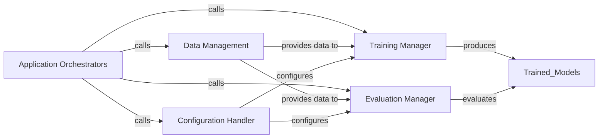

## Details

The TextBrewer system is structured around a set of `Application Orchestrators` that define specific NLP tasks like CMRC2018 distillation, CoNLL2003 NER, and MNLI distillation. These orchestrators coordinate the entire workflow by interacting with core architectural components. The `Configuration Handler` is responsible for setting up the operational parameters for both training and distillation processes. `Data Management` prepares and supplies the necessary datasets, ensuring data is correctly formatted and batched for model consumption. The `Training Manager` oversees the model training, including the intricate distillation process between teacher and student models. Finally, the `Evaluation Manager` assesses the performance of the trained models, providing critical feedback on their effectiveness. This modular design allows for flexible task-specific pipelines while centralizing key functionalities.

### Application Orchestrators
These components are the specific entry points for different tasks (e.g., CMRC2018 distillation, CoNLL2003 NER, MNLI distillation). They encapsulate the high-level workflow for each application, coordinating calls to other components to perform configuration, data handling, training, and evaluation. They represent distinct, task-specific pipelines.

**Related Classes/Methods**:

- <a href="https://github.com/airaria/TextBrewer/blob/master/examples/cmrc2018_example/main.distill.py#L47-L206" target="_blank" rel="noopener noreferrer">`examples.cmrc2018_example.main.distill.main`:47-206</a>
- <a href="https://github.com/airaria/TextBrewer/blob/master/examples/conll2003_example/run_ner.py#L301-L528" target="_blank" rel="noopener noreferrer">`examples.conll2003_example.run_ner.main`:301-528</a>
- <a href="https://github.com/airaria/TextBrewer/blob/master/examples/mnli_example/main.distill.py#L49-L196" target="_blank" rel="noopener noreferrer">`examples.mnli_example.main.distill.main`:49-196</a>

### Configuration Handler
Responsible for loading, parsing, and managing application-wide and task-specific configurations. This includes parameters for training, distillation, model paths, and dataset settings. It ensures that the application orchestrators have access to all necessary parameters.

**Related Classes/Methods**:

- <a href="https://github.com/airaria/TextBrewer/blob/master/src/textbrewer/configurations.py#L35-L98" target="_blank" rel="noopener noreferrer">`textbrewer.configurations.TrainingConfig`:35-98</a>
- <a href="https://github.com/airaria/TextBrewer/blob/master/src/textbrewer/configurations.py#L137-L253" target="_blank" rel="noopener noreferrer">`textbrewer.configurations.DistillationConfig`:137-253</a>

### Data Management
Handles the loading, preprocessing, and batching of datasets for both training and evaluation. It abstracts away the complexities of data handling, providing a consistent interface for the models and training loops.

**Related Classes/Methods**:

### Training Manager
Manages the core training loop, including forward and backward passes, optimization, and loss calculation. In distillation scenarios, it orchestrates the interaction between teacher and student models.

**Related Classes/Methods**:

- <a href="https://github.com/airaria/TextBrewer/blob/master/src/textbrewer/distiller_train.py#L3-L202" target="_blank" rel="noopener noreferrer">`textbrewer.distiller_train.BasicTrainer`:3-202</a>

### Evaluation Manager
Responsible for evaluating the performance of trained models on validation or test datasets, particularly within the distillation context. It calculates and reports relevant metrics specific to the NLP task (e.g., F1 score for NER, accuracy for classification) by comparing teacher and student model outputs.

**Related Classes/Methods**:

- <a href="https://github.com/airaria/TextBrewer/blob/master/src/textbrewer/distiller_utils.py#L106-L132" target="_blank" rel="noopener noreferrer">`textbrewer.distiller_utils.AbstractDistiller`:106-132</a>

### [FAQ](https://github.com/CodeBoarding/GeneratedOnBoardings/tree/main?tab=readme-ov-file#faq)