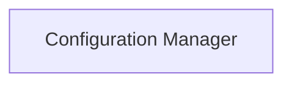

## Details

The Configuration Manager component, primarily encapsulated within the src.textbrewer.configurations module, serves as the central authority for handling all configuration parameters within the TextBrewer project. Its core functionality involves parsing and loading configuration data from various input formats (e.g., JSON files, Python dictionaries) and making this data accessible in a structured manner. This component ensures consistency and centralization of critical settings required for the distillation and training processes.

### Configuration Manager [[Expand]](./Configuration_Manager.md)
Manages all configuration parameters for distillation and training, including model paths, hyperparameters, and strategy definitions. It is responsible for defining the structure of configuration data and providing mechanisms to load, initialize, and represent this data from sources like JSON files or dictionaries.

**Related Classes/Methods**:

- <a href="https://github.com/airaria/TextBrewer/blob/master/src/textbrewer/configurations.py#L213-L253" target="_blank" rel="noopener noreferrer">`src.textbrewer.configurations.__init__`:213-253</a>
- <a href="https://github.com/airaria/TextBrewer/blob/master/src/textbrewer/configurations.py#L129-L134" target="_blank" rel="noopener noreferrer">`src.textbrewer.configurations.from_dict`:129-134</a>
- <a href="https://github.com/airaria/TextBrewer/blob/master/src/textbrewer/configurations.py#L11-L16" target="_blank" rel="noopener noreferrer">`src.textbrewer.configurations.from_json_file`:11-16</a>
- <a href="https://github.com/airaria/TextBrewer/blob/master/src/textbrewer/configurations.py#L125-L127" target="_blank" rel="noopener noreferrer">`src.textbrewer.configurations.__repr__`:125-127</a>
- <a href="https://github.com/airaria/TextBrewer/blob/master/src/textbrewer/configurations.py#L119-L123" target="_blank" rel="noopener noreferrer">`src.textbrewer.configurations.__str__`:119-123</a>

### [FAQ](https://github.com/CodeBoarding/GeneratedOnBoardings/tree/main?tab=readme-ov-file#faq)